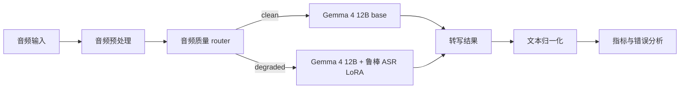
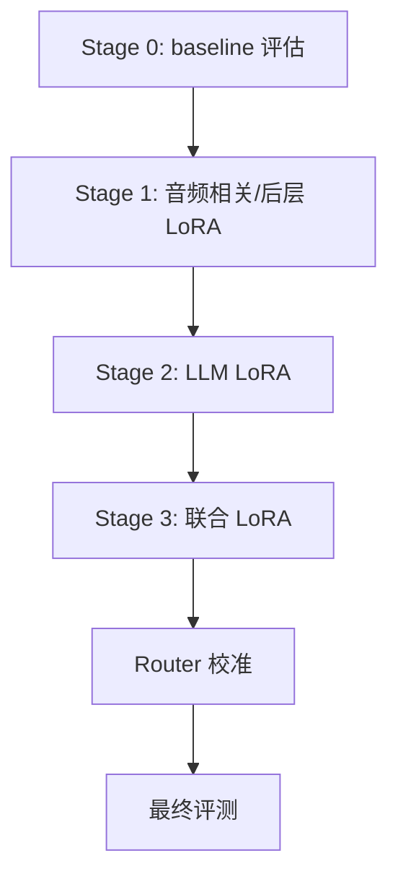

# 架构方案

最后更新：2026-06-07

## 目标

构建一个基于 Gemma 4 12B 的独立鲁棒 ASR 系统，使其在真实退化音频上的识别效果优于原始 Gemma 4，同时尽量不损害 clean speech 表现。

系统以 Gemma 4 12B 作为多模态基础模型，通过我们自己的代码训练 ASR 专用 LoRA adapter。Mega-ASR 只提供方法参考，具体实现必须遵循 Gemma 4 的 API、模块结构和部署约束。

## 为什么这样做

真实 ASR 的主要难点不是 clean speech，而是噪声、远场、混响、遮挡、压缩、失真、丢包等退化条件。通用多模态模型即使支持音频输入，也不一定会稳定做“精确转写”：它可能总结、补全、幻觉、漏词，或者在严重退化时空输出。

因此本项目采用四个核心设计：

1. **以 Gemma 4 12B 为基础模型**：利用其原生音频输入和较强语言能力，避免从零训练 ASR。
2. **用 LoRA 做鲁棒 ASR 适配**：在 Colab 资源约束下训练可行，同时保留 base model 能力。
3. **用场景化退化数据驱动训练**：通过可控退化覆盖真实世界失败模式，而不是只在 clean 数据上提升。
4. **用 router 控制 LoRA 启用时机**：避免鲁棒 LoRA 在 clean speech 上造成不必要退化。

最终架构的目标不是“模型越复杂越好”，而是形成可复现、可评测、可迭代的训练闭环。

## 总体架构



## 模块设计

### 1. 基础模型

初始模型：

- `google/gemma-4-12B-it`

#### 模块目的

提供音频到文本生成能力，作为所有训练和推理模式的基础。

#### 为什么需要

从零训练 ASR 成本过高。Gemma 4 12B 已具备多模态输入和语言生成能力，我们可以把主要工作集中在鲁棒 ASR 适配、数据构建和评测闭环上。

#### 输入

- 音频文件或音频张量。
- ASR prompt。

#### 输出

- 原始转写文本。
- 可选生成元信息，如生成 token 数、耗时。

#### 达成标准

- 能在 Colab 中成功加载或以可接受方式量化加载。
- 能对至少 50 条短音频完成 baseline 推理。
- 输出能被评测脚本解析。
- 记录 baseline WER/CER、空输出率和典型失败样本。

### 2. 音频预处理

#### 模块目的

把不同来源的音频统一成模型和评测可接受的输入。

#### 为什么需要

训练和评测数据可能来自 wav、flac、mp3、不同采样率、单声道或多声道。如果不统一预处理，模型表现和指标会被输入差异污染。

#### 输入

- 原始音频路径。
- 可选处理配置：采样率、声道、最大时长、音量归一化。

#### 输出

- 标准化音频文件或张量。
- 音频元数据：duration、sample_rate、channels、peak、RMS。

#### 达成标准

- 支持 wav/flac，后续可扩展 mp3。
- 默认转为 mono。
- 默认采样率与 Gemma processor 兼容。
- 超长音频有明确切分或拒绝策略。
- 处理结果可复现，同一输入和配置得到同一输出。

### 3. 数据管线

训练数据采用音频与转写文本配对的 JSONL：

```json
{
  "audio": "/path/to/audio.wav",
  "text": "language English<asr_text>TRANSCRIPT",
  "prompt": "Transcribe the speech accurately.",
  "scenario": "noise_reverb",
  "source": "librispeech",
  "is_degraded": true
}
```

#### 模块目的

构建 clean/degraded 训练、验证、测试数据，并为每条样本保留可分析 metadata。

#### 为什么需要

鲁棒 ASR 的提升来自“模型见过足够多且足够真实的退化模式”。只用 clean speech 微调，无法系统改善噪声、远场、混响、失真和丢包场景。

#### 输入

- clean speech 数据。
- 噪声素材、RIR、增强参数。
- split 配置和随机种子。

#### 输出

- `train.jsonl`
- `val.jsonl`
- `test.jsonl`
- 增强后的音频文件。
- 数据构建日志和参数记录。

#### 达成标准

- MVP 至少生成 10k-20k 条训练样本。
- 每条样本包含 `scenario`、`source`、`is_degraded`。
- train/val/test 无原始 utterance 泄漏。
- 测试集固定，不参与训练和调参。
- 至少覆盖 clean、noise、reverb、far_field、clipping、dropout。

### 4. ASR LoRA Adapter

LoRA adapter 是主要训练对象。

需要在加载 Gemma 4 后通过 `model.named_modules()` 探测可训练模块，优先检查：

- 音频投影或音频 embedding 层。
- 注意力投影层：`q_proj`、`k_proj`、`v_proj`、`o_proj`。
- MLP 层：`gate_proj`、`up_proj`、`down_proj`。
- 后几层 transformer block，用于低显存实验。

LoRA target 必须来自 Gemma 4 的实际模块名，不能复制任何参考项目的规则。Mega-ASR 的 LoRA target 正则是 Qwen3-ASR 专用，不属于我们的实现。

#### 模块目的

让 Gemma 4 在退化音频上更像一个精确 ASR 模型，而不是通用音频理解模型。

#### 为什么需要

全参训练成本高，且容易破坏 base model。LoRA 可以在低成本下针对鲁棒 ASR 做参数高效适配，并支持根据场景启停。

#### 输入

- Gemma 4 base model。
- 训练 JSONL。
- LoRA target 配置。
- 训练超参数。

#### 输出

- LoRA adapter checkpoint。
- `training_config.json`。
- 训练日志。
- eval 预测结果。

#### 达成标准

- adapter 可单独保存和加载。
- smoke test 能在 20 条样本上完成若干步训练。
- MVP 训练后至少一个 degraded 场景 WER 相对 base 下降。
- 输出中模板化文本、重复输出、空输出没有明显恶化。
- clean speech regression 被量化。

### 5. 训练管线

训练采用渐进式 LoRA SFT：



#### 模块目的

组织训练实验，使每次训练都有明确目标、输入、输出和验收标准。

#### 为什么需要

直接训练全部 LoRA target 难以判断收益来源，也容易在 Colab 上超显存。渐进式训练能先验证可行性，再逐步扩大目标模块和数据规模。

#### 阶段标准

Stage 0 - Baseline：

- 完成 base model 在固定测试集上的 WER/CER。
- 记录各 scenario 错误率。
- 建立后续所有实验的对照表。

Stage 1 - 音频相关/后层 LoRA：

- 目标是让模型更好接收退化音频信号。
- 至少跑通 smoke test 和一版 MVP 训练。
- degraded 场景不能全面劣化。

Stage 2 - LLM LoRA：

- 目标是减少空输出、漏词、幻觉和语义恢复失败。
- 重点观察严重退化样本。
- clean regression 不应失控。

Stage 3 - 联合 LoRA：

- 目标是综合优化声学适配和语言生成。
- 相比 Stage 1/2 至少在综合指标上有收益。
- 产出候选 release adapter。

Router 校准：

- 目标是在 clean/degraded 混合数据上决定是否启用 LoRA。
- router 模式应优于 always-base，并尽量接近 degraded-only 上的 always-LoRA。

### 6. Router

Router 是一个轻量音频质量分类器。

MVP 版本：

- 输入：log-mel spectrogram。
- 输出：clean / degraded。
- 模型：小型 CNN 或轻量 conformer 分类器。
- 阈值：在验证集上校准。

推理时：

- clean 音频使用原始 Gemma 4 12B。
- degraded 音频使用 Gemma 4 12B + 鲁棒 ASR LoRA。

#### 模块目的

判断当前音频是否需要启用鲁棒 LoRA。

#### 为什么需要

鲁棒 LoRA 可能改善 degraded audio，但也可能轻微损害 clean audio。Router 用来在两者之间做动态选择，减少 clean regression。

#### 输入

- 音频文件或预处理后的 waveform。

#### 输出

- `is_degraded`
- `degraded_prob`
- `threshold`
- `route_source`

#### 达成标准

- clean/degraded 分类准确率和召回率有记录。
- 阈值在验证集上校准，而不是手拍。
- router 模式在混合测试集上优于 always-base。
- clean speech regression 低于测试方案中的阈值。

### 7. 推理管线

#### 模块目的

提供统一推理入口，支持 base、LoRA always-on、router 三种模式。

#### 为什么需要

训练评测和实际使用必须走同一套推理逻辑，否则实验结果无法反映真实部署表现。

#### 输入

- 音频路径。
- 模式：`base`、`lora`、`router`。
- 解码参数。

#### 输出

- 转写文本。
- 使用的模式。
- router 结果，如果有。
- 耗时和 RTF。

#### 达成标准

- 三种模式都能对同一批 JSONL 跑批量推理。
- 输出 JSONL 与评测脚本兼容。
- 推理失败能记录错误，不中断整批评测。

### 8. 评测管线

评测输入固定为 JSONL：

```json
{
  "audio": "/path/to/audio.wav",
  "answer": "reference transcript",
  "language": "en",
  "scenario": "far_field_noise"
}
```

输出应包含：

- prediction
- WER 或 CER
- 按 scenario 聚合的错误率
- empty output 标记
- hallucination 标记，如果可以检测
- router 决策，如果启用 routing

#### 模块目的

量化每次训练是否真的改善鲁棒 ASR，而不是只改善主观样例。

#### 为什么需要

ASR 训练很容易被个别样例误导。必须按 scenario、语言、clean/degraded、失败类型分别统计，才能判断下一步该扩数据、改 LoRA target，还是调 prompt。

#### 达成标准

- 支持 WER/CER。
- 支持按 scenario 聚合。
- 保存原始 prediction 和归一化 prediction。
- 输出整体指标、场景指标和失败样本列表。
- 每次训练结果都能与 baseline 对齐比较。

## 部署模式

### Mode A: Base Only

用途：

- 建立 Gemma 4 原始能力基线。
- 判断 LoRA 是否真正带来提升。

达成标准：

- 可稳定跑完整评测集。
- 指标作为所有训练实验的基准。

### Mode B: LoRA Always On

用途：

- 测试鲁棒 adapter 本身能力。
- 判断 adapter 是否值得引入 router。

达成标准：

- degraded 场景相比 base 有提升。
- clean 场景退化被量化。
- 没有严重格式污染或重复输出。

### Mode C: Router + Conditional LoRA

用途：

- 目标生产模式。
- 在 clean 与 degraded 混合输入中动态选择推理路径。

达成标准：

- 混合测试集整体优于 base。
- clean regression 小于预设阈值。
- degraded 场景接近 LoRA always-on 表现。

## 产品里程碑验收标准

### Milestone A: Baseline 完成

- Gemma 4 baseline 可运行。
- 至少 50-200 条样本完成评测。
- 输出 baseline 指标和失败样本。

### Milestone B: 数据 MVP 完成

- 生成 10k-20k 条训练样本。
- 覆盖至少 5 类退化。
- split 无明显泄漏。
- 数据 manifest 可复现。

### Milestone C: LoRA MVP 完成

- QLoRA 训练能在 Colab 跑通。
- adapter 可保存、加载、推理。
- 至少一个 degraded 场景相对 base 有 10% WER 改善。

### Milestone D: Router MVP 完成

- router 可输出 clean/degraded 概率。
- router 模式优于 always-base。
- clean regression 小于 5% 相对退化。

### Milestone E: Scale-Up 候选完成

- degraded 平均 WER 相对 base 下降 15%-25%。
- 结果在至少两个数据源上成立。
- 训练、数据、评测流程都可从文档复现。

## 独立性说明

最终代码库应独立于 Mega-ASR。需要自行实现的 Gemma 组件包括：模型加载、音频 prompt 处理、collator、LoRA target 探测、推理 API、评测，以及可选 router 集成。

Mega-ASR 可以保留为外部 baseline 和设计参考，但不应成为运行时依赖。
