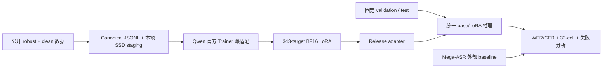
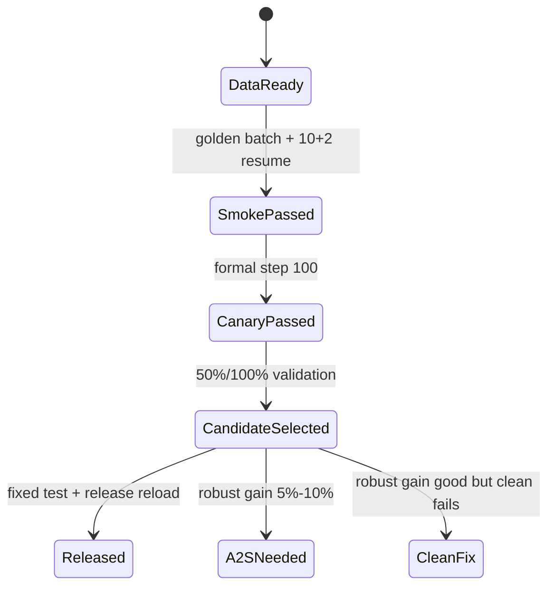

# 架构方案

最后更新：2026-07-12

## 目标

构建一个独立的 Qwen3-ASR-1.7B 鲁棒 ASR 微调闭环。Mega-ASR 只作为方法和外部
baseline，不作为代码底座。

## 当前实现切片

第一轮没有 router、teacher、A2S 或 RL 运行依赖。它们只由结果门触发。

## 模块边界

### 数据层

输入：公开数据 id/revision、split、seed 和配额配置。

输出：Canonical JSONL、source/revision/license 记录、stats、rejects、hash 和本地 resolved
audio 路径。

约束：同一 source utterance 的退化版本不能跨 split；训练只读本地 SSD，Drive 只保存
大 shard 和持久 artifact。

### 训练层

输入：train/validation JSONL、pinned Qwen revision、LoRA 配置和 resolved runtime 配置。

输出：adapter、Trainer state、processor/revision、target_modules、日志和 validation 指标。

训练入口基于 Qwen 官方 finetuning prompt/collator/Trainer 结构；本项目只维护 JSONL
适配、PEFT 注入、分组校验、generation validation 和 release 元数据。

### 推理层

统一入口通过可选 `adapter_dir` 支持：

- BF16 base。
- BF16 base + LoRA。

每条结果增量写入 JSONL，支持 resume；单条失败写 `error` 后继续。模型 id/revision、
adapter、dtype、decoding 和耗时随行或随 run manifest 保存。

### 评测层

输入：统一 prediction JSONL。

输出：English WER、Chinese CER、32-cell macro、clean regression、失败率、逐样本 edits、
comparison 和 error analysis。

Evaluator 必须拒绝空 reference，不把中文 character edits 与英文 word edits 合并。

### 发布层

Release manifest 绑定：

- base model id/revision。
- adapter 与 processor。
- target 分组和实际参数量。
- manifest hash、数据 revision 和 seed。
- resolved training config、依赖版本和 git commit。
- 固定测试指标和批量推理命令。

## LoRA 设计

第一轮使用本项目模块快照独立生成的 343 个 Linear target：audio attention/MLP、speech
projection、decoder attention/MLP。排除 `lm_head`、embedding、norm 和三个 Conv2d
frontend。target 按分组校验，不读取 Mega-ASR target 代码。

选择 broad joint LoRA 是为了用一次训练同时验证 acoustic grounding 和 semantic recovery；
它不是已经证明的最终最优结构。固定 `r=8`、`alpha=16`、`dropout=0.05`、`lr=1e-6`，
不做首轮 sweep。

## 运行状态

## 条件触发模块

### 压缩 A2S

只在直接 SFT 改善 5%-10% 或产品已通过但仍明显落后 Mega-ASR 时实现。使用固定 30k
base-WER 子集，在一个编排任务中执行 acoustic、decoder、joint 三阶段，不建立新的 target
实验树。

### Router

只在 robust 明显改善但 clean 回退仍超标时实现。目标应预测“LoRA 是否比 base 更好”，
不能只预测 clean/degraded。

### GPT-5.5 Teacher

只处理未来未标注真实音频或 transcript 冲突。使用 API key/base URL/model 环境变量；
actual endpoint 未通过音频 capability probe 时，只能做文本审校。

### RL

只有 A2S 后仍存在高 WER hallucination/omission 且 rule-based 指标不足时才评估。第一轮
不实现 RL 或 LLM judge。

## 验收

架构完成不是“文件存在”，而是：公开 manifest 可复现、Trainer 可真正 resume、统一推理
可恢复、Evaluator 可计算双语/32-cell、release adapter 可在新进程加载，并有 BF16 base 与
Mega-ASR 外部 baseline 对比。
