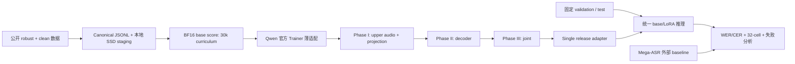
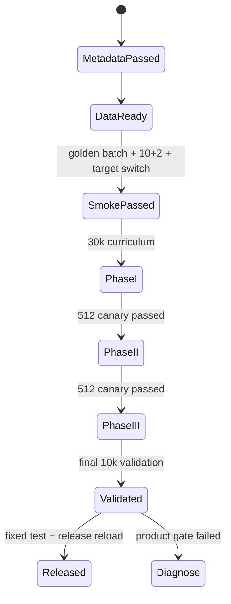

# 架构方案

最后更新：2026-07-22

## 目标

构建一个独立的 Qwen3-ASR-1.7B 鲁棒 ASR 微调闭环。Mega-ASR 只作为方法和外部
baseline，不作为代码底座。

## 当前实现切片

第一轮直接实现 A2S，不先跑 direct joint SFT。Teacher、router 和 RL 没有运行依赖；
它们也不是 A2S 失败后的自动步骤。

## 模块边界

### 数据层

输入：公开数据 id/revision、split、seed 和配额配置。

输出：Canonical JSONL、source/revision/license 记录、stats、rejects、hash 和本地 resolved
audio 路径。

约束：同一 source utterance 的退化版本不能跨 split；训练只读本地 SSD，Drive 只保存
大 shard 和持久 artifact。

### 训练层

输入：train/validation JSONL、pinned Qwen revision、LoRA 配置和 resolved runtime 配置。

输出：adapter、Trainer state、processor/revision、target_modules、日志和 validation 指标。

训练入口基于 Qwen 官方 finetuning prompt/collator/Trainer 结构；本项目只维护 JSONL
适配、PEFT 注入、A2S target 切换、分组学习率、generation validation 和 release 元数据。

### 推理层

统一入口通过可选 `adapter_dir` 支持：

- BF16 base。
- BF16 base + LoRA。

每条结果增量写入 JSONL，支持 resume；单条失败写 `error` 后继续。模型 id/revision、
adapter、dtype、decoding 和耗时随行或随 run manifest 保存。

### 评测层

输入：统一 prediction JSONL。

输出：English WER、Chinese CER、32-cell macro、clean regression、失败率、逐样本 edits、
comparison 和 error analysis。

Evaluator 必须拒绝空 reference，不把中文 character edits 与英文 word edits 合并。

### 发布层

Release manifest 绑定：

- base model id/revision。
- adapter 与 processor。
- target 分组和实际参数量。
- manifest hash、数据 revision 和 seed。
- resolved training config、依赖版本和 git commit。
- 固定测试指标和批量推理命令。

## LoRA 与 A2S 设计

本项目从 pinned Qwen revision 独立生成 343 个 Linear target：audio attention/MLP、speech
projection、decoder attention/MLP。排除 `lm_head`、embedding、norm 和三个 Conv2d
frontend。target map 与 hash 必须由运行时快照生成，不读取 Mega-ASR target 代码。

所有 343 个 target 在一个 adapter 中一次注入，三个阶段只切换 `requires_grad` 和 optimizer
parameter groups：

| 阶段 | 有效 target | 数据 | 目的 |
| --- | ---: | --- | --- |
| Phase I | upper-4 audio 24 + projection 3 = 27 | 30k error curriculum，2 epoch | acoustic grounding |
| Phase II | decoder 196 | 200k，1 epoch | semantic recovery |
| Phase III | 全部 343 | 200k，1 epoch | end-to-end alignment |

单 adapter 避免阶段间 merge、自定义 loader 和多 adapter 发布依赖。固定 `r=8`、`alpha=16`、
`dropout=0.05`，不做首轮 target/rank/LR sweep。

## 运行状态

## 后置模块

### Router

只在 robust 明显改善但 clean 回退仍超标时实现。目标应预测“LoRA 是否比 base 更好”，
不能只预测 clean/degraded。

### RL

只有 A2S 产品门通过、但高错误率样本仍集中为空输出、幻觉或漏句，且与 Mega-ASR 的
差距可归因于这些失败时才评估 rule-based DG-WGPO。第一轮不实现 RL 或 LLM judge。

## 验收

架构完成不是“文件存在”，而是：公开 manifest 可复现、A2S 三阶段可真正 resume、每阶段
只更新允许的 target、统一推理可恢复、Evaluator 可计算双语/32-cell、release adapter 可在
新进程加载，并有 BF16 base 与 Mega-ASR 外部 baseline 对比。
