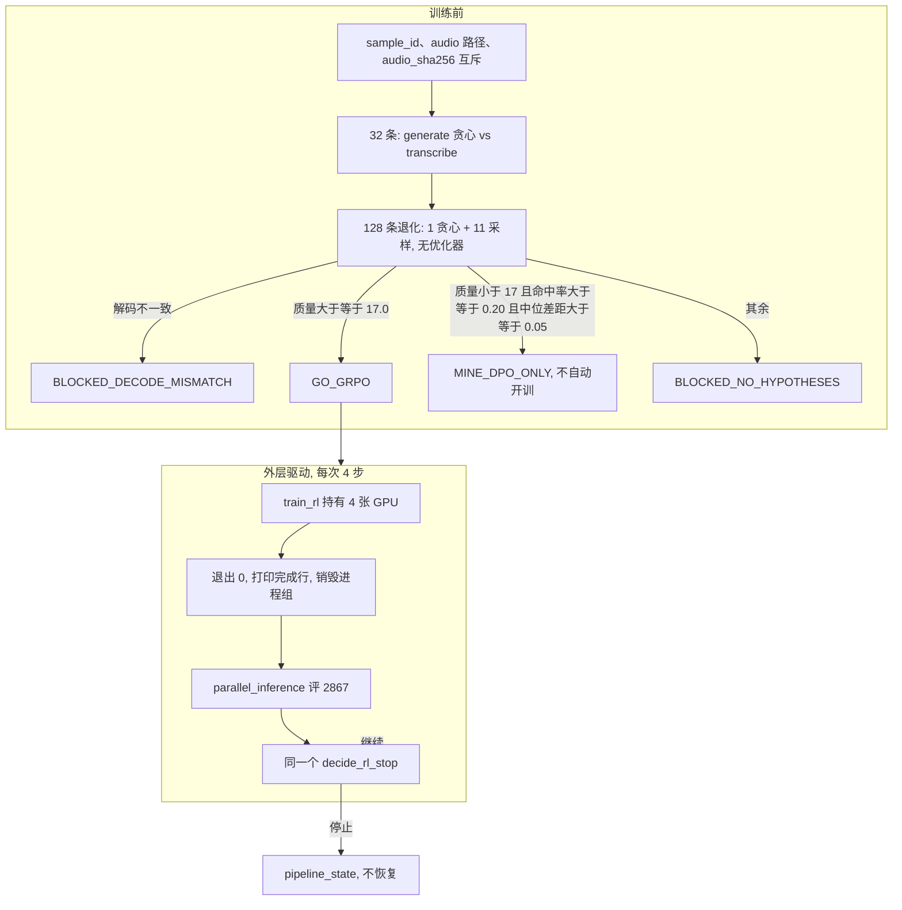
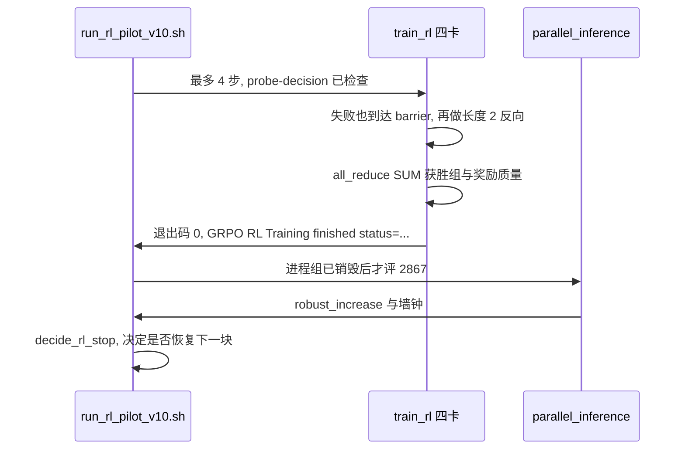

# RL v10：退化集两轮锚定 GRPO

| 项 | 值 |
| --- | --- |
| 作者 | design-doc-writer |
| 日期 | 2026-09-28 |
| 状态 | 已执行并归档（2026-09-29，Step 8 `BLOCKED_TRANSFER`） |
| 运行名 | `rl_pilot_v10`（只在探针放行后才允许训练） |
| 发布底座 | 仍是 DPO Champion：`/data/mega-asr/runs/dpo_pilot_v2/merged_base` |
| 基础模型 | `Qwen/Qwen3-ASR-1.7B`，revision `7278e1e70fe206f11671096ffdd38061171dd6e5` |
| 训练机 | 4×V100 32GB，`/data/mega-asr`，`torchrun --standalone --nproc_per_node=4` |

## 执行结果（2026-09-29）

v10 已在 V100 上跑完。探针决策 `GO_GRPO`，投影奖励质量 `17.10`。训练在 Step 8 停止，状态 `BLOCKED_TRANSFER`：累计奖励质量 `18.12`，贪心 held-out 从 Step 0 的 `0.8773` 到 Step 8 的 `0.8771`。LoRA B 最大绝对值 `6.56e-5`，`raw_kl` `7.1e-5`。Step 4 与 Step 8 的 2,867 条门禁都是 FAILED。没有导出 `merged_base`，也没有写入 DPO Champion。检查点只作诊断。

本文件动笔时的非目标包含「不提高学习率」。Step 8 的 2,867 条已经是 Robust `−0.000404`（−6 次编辑），贪心奖励 `−0.0002`。随后把学习率改成 `2e-5` 的 v11 已在 Step 7 停止，2,867 条仍是 −6 次编辑，贪心奖励 `−0.0006`。对照和收口写在 `10_rl_v11_design.md`。两次检查点都只作诊断。

驱动是 `scripts/run_rl_pilot_v10.sh`。服务器上 2026-09-29 执行的那份没有重跑门闩。本仓库收录的副本在文件开头拒绝再次启动，除非显式设置 `RL_V10_ALLOW_RERUN=1`。

下文从「概述」起保留 2026-09-28 动笔时的方案，包括当时点名的跨文档漂移。那些句子描述动笔时的仓库：03 的温度 0.7、07 和 08 里「导出 held-out reward 最高检查点」、固定 7,680 / 15,360 行审计，以及用 `finish_rl_pilot_v7.sh` 改 `RL_RUN_DIR` 跑后续 pilot。2026-09-29 已在 02、03、05、07、08、`00_progress.md` 和目录 README 里改到与本次执行一致。现行口径以 `08_execution_contract.md` 和 `10_rl_v11_design.md` 为准。

## 概述

v6–v9 已经把两件旧故障从候选原因里排除：`lr=2e-6` 时 LoRA 几乎不动（v6/v7，`raw_kl ~ 1e-6`）；无锚点 GRPO 会强化「四个采样里没那么差的一条」，即使它比贪心解码更差（v8）。v9 把学习率放在 `1e-5`、用贪心解码做锚、奖励至少高出 `0.02` 才更新，策略仍然几乎不动：768 个组里只有 92 个产生梯度，`raw_kl` 只到 `7.2e-5`，1,698 条采样 held-out 从 `0.8717` 走到 `0.8713`。

采样平均奖励的 `+0.002` 不再当通过条件。理由是实测，不是把获胜组数线性换成 KL：v8 相对自己的 Step 0 从未出现过正的采样奖励差；最大的一次移动是 Step 4 的 −0.0016，当时训练日志里的 `raw_kl` 是 `5e-5`，和 v9 同一量级。`results/rl_pilot_v8/loss_log.jsonl` 里 `raw_kl` 的峰值 `0.000452` 在 Step 10，不是采样均值移动的那一步。Step 12 的 `raw_kl` 是 `0.000226`，采样奖励回到 `0.8747`。

主方案仍是一次可停止的 v10：只训退化语音；第一轮 1 条贪心 + 3 条采样，没打过贪心才加第二轮 8 条；反向始终是定长 2 条序列。接受指标是发布解码上的贪心 WER/CER，优化目标是 1,698 行上的贪心序列奖励，门槛仍是 `+0.002`。`robust_retention` 保持 `round(pilot − ref, 6) <= 0`，不加 ±1 处编辑豁免。v9 Step 4 的 Robust −0.0053pp（净编辑 −1）在这条规则下已经通过 `robust_retention`，它失败的是采样 `held_out_reward`。把奖励定义改成贪心，不能变成让那一个检查点通过的原因；也没有测过它的 1,698 行贪心奖励是否达到 `+0.002`。

训练前先做 128 条退化语音的无梯度探针。放行看的是奖励质量 `update_rate_k11 × median_winning_gap_k11 × 768`，不是命中率。探针不过就不启动 12 步。DPO Champion 继续是唯一发布权重。不声称达到或超过 Mega-ASR。

## 背景与动机

正式顺序仍是 SFT → DPO → RL。E4 SFT 与 E5 DPO 已通过。E6 的 RL pilot 从 v1 到 v9 都没有同时通过 held-out 奖励和 `validation.jsonl` 上的贪心 WER/CER 门禁。当前代码已经实现本设计要保留的部分：

- `train/train_rl.py` 的 `compute_anchored_advantages`：下标 0 是贪心，`best_gap < min_improvement`（0.02）时整组优势为 0。差距恰好等于 0.02 会更新。部分优势是 `gap / best_gap`；`tests/test_train_rl.py` 期望一条 0.04 的差距在最好差距 0.10 时得到 `0.4`。
- `configs/train/qwen3_asr_rl.yaml` 的 `grpo.advantage.anchor: greedy`、`min_improvement: 0.02`、`learning_rate: 1.0e-5`、`kl_regularization.beta: 0.04`、`lora_dropout: 0.0`、`loss_reduction: sequence_sum`。
- 训练循环在 `anchor_mode == "greedy"` 时先 `do_sample=False` 生成 1 条，再采样 `group_size - 1` 条（约 1329–1385 行）。
- 参考模型是同一套权重上的 `disable_adapter()`（约 1446–1456 行），KL 是 `compute_grpo_group_loss` 里的 Schulman K3。
- DDP 使用 `find_unused_parameters=False`（约 1089–1094 行）。某个 rank 在集体通信前 `continue`，其余 rank 会在下一次 `backward` 或新加的 `barrier` 上死锁。

真正还在优化的目标和真正用来发布的解码并不相同。`evaluate_rl_validation`（约 757–873 行）对验证集每条语音用训练温度采样 `G` 条，`do_sample=True`，没有贪心锚，而且调用点没有把 `max_eval_samples` 传进去。约 948 行算出的 `val_eval_samples`（缺省 50）是死变量。`evaluation/verify_gate.py` 的 `held_out_reward` 把采样平均和同一次运行的 Step 0 相减，门槛 `0.002`。发布路径是 `inference/run_inference.py` 的 `run_single_inference` → `Qwen3ASRModel.transcribe`，再由 `evaluation/eval_wer.py` 的 `score_item` 算 WER/CER。

v9 Step 4 的 2,867 条贪心结果是 clean −0.006pp、robust −0.0053pp、退化净编辑 −1（`en|distortion` −4，`en|noise` +4，`en|dropout` −1）。负的 macro 已经满足 `robust_retention`。那一步失败的是采样奖励。Step 8/12 的 robust 转正，`robust_retention` 才失败。v8 Step 4 则是正的 `robust_error_rate_increase: 7e-06`，`results/rl_pilot_v8/gate_step_4.json` 里 `robust_retention` 为 FAILED。采样奖励和贪心 WER 在这些检查点上可以反向移动，而且都在 `0.002` 以下。

数据配比还和验证集相反。`build_epoch_sample_indices` 的 `balanced` 策略把虚拟 epoch 做成 50% 退化、25% 英文 clean、25% 中文 clean（3,000 行 → 4,000 长度）。`rl_val_pool.jsonl` 是 1,698 行，其中 1,298 条退化（76%）。v9 的 clean 组可更新率是 6.7%，退化组贡献了 92 次更新里的 65 次。一半的 GPU 步数花在几乎不会打过 DPO 贪心的 clean 上。

`audit_rollouts` 把每组行数写死成 4（约 535–538 行）。CLI `--sample-strategy` 的 argparse 默认值是 `"balanced"`（约 1820 行），`train_rl` 的 Python 形参默认也是 `"balanced"`（约 894 行），配置只在参数为空时才被读到（约 1015 行）。`train/README.md` 和 `scripts/finish_rl_pilot_v7.sh`（约 79 行）都显式传入 `balanced`。只改 YAML 不够：那个 shell 在 `RL_RUN_DIR` 被改成别的 run 时仍会盖掉 `degraded`。动笔时 `scripts/README.md` 还告诉操作者用这个脚本跑后续 pilot。2026-09-29 起，该 README 写明 v10/v11 用各自的驱动，只改 `RL_RUN_DIR` 不能把 v7 脚本拿去跑后续 pilot。

`verify_gate.py` 不读 `configs/train/qwen3_asr_rl.yaml` 的 `gates:`。阈值来自 CLI 默认值。任一 Robust macro 缺失时，约 149–150 行把 `robust_passed` 设为 True。`zero_variance_ratio is None` 时约 161 行让零方差检查通过。约 481 与 509 行在给出 `--reward-improvement` 时跳过 loss log，因此只写在「从日志取值」分支里的 SHA / `val_decode` 检查可以被这个旗标绕开。Step 0 基线今天取第一条 `val_eval_scope == "Full Held-out"` 的记录（约 1205–1208 行）。若 Step 0 先写一条 `val_decode=sample` 的诊断、scope 仍是 `Full Held-out`，它会变成提前停止的基线。

## 目标与非目标

### 目标

- 在 4×V100 上，用现有 3,000 行 pilot（2,000 退化 + 500 英文 clean + 500 中文 clean）和冻结的 DPO Champion，做一次锚定 GRPO。不新增人工标注。
- 只在「采样转写的序列奖励至少高出当前贪心 0.02」的组上产生非零优势。差距恰好 0.02 算打过。
- 把优化目标和接受指标都放到贪心解码上。采样平均奖励只记日志。
- 探针用奖励质量而不是命中率决定是否训练。不够就阻断。
- 写死停止条件，并且让训练进程和 2,867 条 WER 评估不抢同一组 GPU。
- 通过门禁才允许把该 run 当作 RL 候选。不通过则发布底座不变。

### 非目标

- 不提高学习率，不再跑 `2e-5`，也不把「再加步数的同一 4 采样循环」当作方案。
- 不把 `compute_group_advantages` 的无锚点标准化优势重新用作训练损失。该函数保留，供对照和单测。
- 不修改 β。v10 的 `grpo.kl_regularization.beta` 仍是 `0.04`。
- 不放宽 `max_robust_macro_regression = 0.0`，不加「±1 处编辑」豁免，也不把已经为负的 macro 改判成失败。
- 不把获胜组数线性换成 `raw_kl`，也不把这个外推写进合同。
- 不启动 Full RL（合同 E7：16,000 退化 + 1,000 英文 clean + 1,000 中文 clean）。E6 未通过之前 E7 保持阻断。
- 不声称达到或超过 Mega-ASR。不使用 `references/mega-asr-upstream/` 的训练入口、wrapper 或 LoRA target。`references/` 继续 gitignore。
- 不用 Colab 或 Google Drive 做训练合同。不改奖励公式，不改 199 个 LoRA target，不改 LoRA rank。
- 撰写本文时不启动训练。2026-09-29 的执行结局写在文首。学习率调整不回写进这份 v10 方案，记在 `10_rl_v11_design.md`。

## 方案

### 实测诊断（不再争论这些数）

训练 manifest 3,000 行。`balanced` 虚拟 epoch 4,000。验证池 `rl_val_pool.jsonl` 1,698 行（1,298 退化 + 400 clean），SHA-256 `b0701db2ec3735222179e21fb4bf3c49c256d8da5d3a85cb7e61bfa6b7d9cd99`。573 行旧池（SHA-256 前缀 `a50f1724`，Step 0 奖励 `0.9379`）已退役，不得再当基线。贪心 WER 门禁用冻结的 2,867 行 `validation.jsonl`。

| 运行 | 设置 | 结果 |
| --- | --- | --- |
| v6 | `lr=2e-6`，线性衰减，30 步，token-mean，温度 0.85/0.92/50 | `raw_kl ~ 1e-6`，LoRA B 最大绝对值 `2.62e-5`。held-out Step 0 `0.8747`，最好的 Step 20 `0.8743`（−0.0004）。Step 20 贪心 Robust −0.0038pp，奖励门失败 |
| v7 | 同上学习率，sequence-sum | AdamW 加 `clip_grad_norm_(max_norm=1.0)` 把损失放大抵消掉。Step 30 LoRA B 最大绝对值 `2.65e-5`。最好 Step 10 奖励 +0.0012，Robust +0.0157pp。门禁失败 |
| v8 | `lr=2e-5` 常数，12 步，无锚点，温度 0.85 | 采样 held-out `0.8747 → 0.8731 → 0.8739 → 0.8747`，相对 Step 0 没有正增量。Step 4 的 `raw_kl` 是 `5e-5`，奖励差 −0.0016。峰值 `raw_kl` `0.000452` 在 Step 10。Step 12 的 `raw_kl` 是 `0.000226`，奖励回到 `0.8747`。Robust：Step 4 `+7e-06`（`gate_step_4.json`，即 +0.0007pp），然后 +0.0111pp、+0.0645pp |
| v9 | `lr=1e-5`，温度 1.0，`top_p=0.95`，dropout 0，贪心锚，`min_improvement=0.02`，12 步 | 768 组：537 奖励相同，139 有差别但没高出贪心 0.02，92 次更新（65 退化，27 clean）。获胜差距中位数 `0.071`，这是 3 条采样里已经获胜的条件中位数。`raw_kl` 到 `7.2e-5`。采样 held-out `0.8717 → 0.8714 → 0.8714 → 0.8713`。Step 4 贪心 clean −0.006pp、robust −0.0053pp、净退化编辑 −1。Step 8/12 Robust 转正 |

仓库里没有 v9 的 `loss_log.jsonl`。上表 v9 行用的是任务给定的数，不是本仓库重新测出来的。v8 的 `raw_kl`、采样奖励和 `+7e-06` 来自 `results/rl_pilot_v8/`。

v8 无评估步的 `step_seconds` 是 90–110 秒，九步平均 97 秒。这 97 秒是 64 条语音 × 4 条假设，含参考前向和反向。Step 1/5/9 的千秒计时把上一次 1,698×4 采样评估算了进去；评估本身约 16.5–17 分钟。2,867 条 `transcribe` 的 25 分钟是本设计的输入假设，本仓库的日志没有这条测量。

v9 的 12 步 × 全局 batch 64 = 768 组。92/768 = 12.0%。按 `balanced` 的 50/50，退化侧 65/384 = 16.9%，clean 侧 27/384 = 7.0%，与给出的 clean 可更新率 6.7% 是同一量级。下文用 16.9% 只作为「第二轮没生效」时的对照，不作为放行门槛。

独立假设下，由第一轮命中率反推的每条额外采样概率 q≈0.060，第二轮 8 条后的总命中率约 0.493、约 379 个获胜组。这只说明第二轮值得用探针去测。采样正相关时 q 更小。这个 0.493 不是承诺产量，也不再换算成 KL。

### 为什么采样平均的 +0.002 不再当通过条件

v8 是采样奖励相对 Step 0 动得最大的一次，幅度 −0.0016，发生在 `raw_kl = 5e-5`，不是发生在峰值 `4.5e-4`。峰值那一步以及 Step 12（`raw_kl = 2.3e-4`）都没有留下一个正的采样增量；Step 12 的采样奖励回到 Step 0。v9 在 `7.2e-5` 上的采样变化是 −0.0003。两次都没有正的 `+0.002`，而且 v8 最大的负向移动和 v9 的 KL 是同一量级。

因此不需要、也不应该再写「92 × (4.5e-4 / 7.2e-5) ≈ 575 个获胜组，所以要大约 22 条采样」。那个等式把 Step 10 的峰值 KL 当成了 Step 4 的均值移动。合同里不收录 575，也不收录 22。

还有一个缩放问题，使「每个获胜组贡献 v9 那么多 KL」不能当规划公式。v9 的损失是长度 4 的组平均，组里还有 `gap / best_gap` 的分数优势（单测里的 `0.4`）。v10 的损失是长度 2 的平均，获胜样本的优势固定为 1，贪心为 0。获胜样本在裁剪前的系数大约是 v9 那种分数优势的两倍，再被「除以 2」而不是「除以 4」缩放。`raw_kl` 对获胜组数的比例不必等于 `7.2e-5 / 92`。这个比例是假设，由每次运行的 `raw_kl` 日志来核对，不进入 `decide_rl_stop` 的剂量算术，也不写进 `08_execution_contract.md`。

`raw_kl > 5e-4` 仍是一条直接看日志的天花板：v8 的 Robust 变差发生在 `raw_kl` 从 `5e-5` 爬到 `4.5e-4` 的过程里。这条规则不依赖获胜组到 KL 的换算。

### 主方案：退化集、两轮搜索、贪心锚、贪心门禁

发布产品看的是 2,867 行 `validation.jsonl` 上的贪心 WER/CER（`transcribe` + `eval_wer.py`）。训练信号是「某条采样的序列奖励至少不小于当前贪心加 0.02」。v10 把 held-out 优化目标改成同一条贪心定义，而不是温度采样的平均值。

四个一起落地的决定：

1. **`sample_strategy: degraded`。** 虚拟 epoch 等于退化行数（pilot 为 2,000），只打乱退化行。clean 行留在 manifest 里做审计，不进优化器。12 步 × 64 = 768 < 2,000，这一轮里没有语音被重复强化。clean 保留交给 2,867 的贪心门禁。策略解析只有一个函数，CLI、YAML 和直接调用 `train_rl` 都走它。
2. **两轮采样，只在第一轮没打过贪心时付第二轮。** 第一轮保持 1 条贪心 + 3 条 `temperature=1.0, top_p=0.95, top_k=50`。状态不是 `update` 时，再用 `cand_seed + 10007` 抽 8 条。已经获胜的组不再抽。
3. **损失批固定为 2 条序列。** 下标 0 是贪心，优势 0。下标 1 是打过门槛的最好样本，优势 1；并列时取得分相同的最小采样下标，保证同一个奖励向量不会选出两种文本。没有获胜样本时，下标 1 重复贪心文本，两条优势都是 0，走现有的 `zero_variance=True` 图连通零损失。四个 rank 的张量形状始终一致，不打开 `find_unused_parameters`。分数优势只写进 rollout。音频缺失、读失败、生成异常、第二轮拆批后仍 OOM，都走同一条占位路径：本 rank 仍到达 `barrier`，仍做长度 2 的零优势反向。禁止在 `barrier` 之前 `continue`。
4. **门禁看贪心，不看采样均值。** Robust 的通过线不变：增量 `<= 0`。负的 macro 继续通过。正的 `+7e-06` 继续失败。没有编辑数豁免。

学习率、调度器、β、dropout、sequence-sum、梯度裁剪保持 v9：`1e-5` 常数、warmup 2、β `0.04`、dropout 0、`clip_grad_norm_` 的 `max_norm=1.0` 仍在约 1523 行。`grad_norm` 只记日志，不作为停止条件。`0.3` 这个阈值是在长度 4 的损失上臆测的，v10 的裁剪前尺度已经变了，写进 `decide_rl_stop` 会再钉死一个没有测量的数。

参考政策仍是冻结的 DPO Champion，通过 `disable_adapter()` 计算 K3。不另加载第二份 1.7B 权重。



### 贪心奖励的 +0.002 用奖励质量，不用获胜组个数

1,698 行上均值 `+0.002` 的总奖励质量是：

```text
1698 × 0.002 = 3.40 奖励点
```

这是 held-out 要凑齐的数。它等于约 48 行各提高 0.071，或 170 行各提高 0.02。这两个说法不是同一个训练剂量。`0.071` 是 v9 在前 3 条采样里已经获胜的条件中位数。第二轮要找的是前 3 条没打过的组，差距会更靠近 0.02 的地板。因此：

```text
250 × 0.071 = 17.8 奖励点，要覆盖 3.40 大约需要 19% 的转移
250 × 0.02  = 5.0  奖励点，要覆盖 3.40 大约需要 68% 的转移
```

不能把「250 个获胜组」同时当成这两件事。v9 也没有测出 19% 这个系数。采样 held-out 的变化约是 `1698 × (−0.0003) ≈ −0.5` 奖励点。同一检查点上仅有的贪心测量是 Robust −0.0053pp、净编辑 −1，方向相反，两者都远小于 `0.002`。1,698 行上的贪心奖励转移没有被测量。下文不把 v9 的贪心转移叫成负数，也不引用 19%。

剂量定义成探针上的奖励质量，12 步、每步 64 组、共 768 组：

```text
projected_train_reward_mass
  = update_rate_k11 × median_winning_gap_k11 × 768
```

`GO_GRPO` 只在这个乘积 ≥ **17.0** 时给出。17.0 = 5 × 3.40。5 倍是规划门槛：训练侧至少堆出数倍于 3.40 的差距质量，即便只有一小部分转过去，才有机会碰到 held-out 的 `+0.002`。它不是测得的转移率。`search_probe.json` 必须写下这个乘积，以及用同样公式算的 `mass_k3`。训练进程重新计算乘积，不相信被人改过的 `decision` 字符串。

对照（都用 768 组）：

| 情形 | 命中率 | 中位差距 | 质量 | 是否 GO |
| --- | --- | --- | --- | --- |
| v9 的退化第一轮，差距仍用 0.071 | 0.169 | 0.071 | 9.2 | 否 |
| 独立模型的 0.493，但差距掉到地板 0.02 | 0.493 | 0.02 | 7.6 | 否 |
| 命中率 0.45，中位差距 0.05 | 0.45 | 0.05 | 17.3 | 是 |
| 命中率 0.35，中位差距仍是 0.071 | 0.35 | 0.071 | 19.1 | 是 |

v9 全训练的 `92 × 0.071 ≈ 6.5` 同样低于 17.0。命中率高但差距贴着 0.02 时也不放行。这就是质量门和旧的「K=11 命中率 ≥ 0.35」的差别。

运行中的 `cumulative_reward_mass` 是每个获胜组的 `best_reward − greedy_reward` 之和。四卡先 `all_reduce(SUM)` 获胜组数、组数和质量，再相除得到比例。禁止先在 rank 内做比例、再对比例取平均：那会把 80 / 150 / 250 这类阈值缩小 4 倍。`cumulative_winners` 同样是全局和，只用于日志，不再当停止阈值。

停止用的是同一条质量：

- Step 12 的剂量地板就是 17.0。累计质量 ≥ 17.0 而贪心增益仍 < `+0.001`，才是 `BLOCKED_TRANSFER`：剂量按探针的定义已经到了，转移没有。
- Step 8 的转移地板是 `17.0 × 8/12 = 11.33`，而且只在 `global_step == 8` 时使用。质量 ≥ 11.33 且贪心增益 < `+0.001` 才标 `BLOCKED_TRANSFER`。这条不延伸到 Step 12：质量只增不减，Step 8 的 11.0 若按同速走到 Step 12 大约是 `11.0 × 12/8 = 16.5`，仍然小于 17.0，必须是 `BLOCKED_SEARCH`，不能因为 `16.5 ≥ 11.33` 被叫成转移失败。
- Step 8 累计质量 < `0.75 × 11.33 = 8.50` 时标 `BLOCKED_SEARCH`。8.50 到 11.33 之间、增益仍 < `+0.001`：不贴这两个标签，把剩下 4 步跑完，到 Step 12 用 17.0 再判。
- 第 5、6、9 条质量停止在本次贪心增益已经 ≥ `+0.002` 时不返回。3.40 个 held-out 奖励点可以出现在训练质量还没到 8.50 之前。这种块交给驱动去评 2,867；门禁 `PASSED` 就是候选，不再恢复。增益没到 `+0.002` 时，低质量仍然是 `BLOCKED_SEARCH`，不导出。
- 第二轮完全没生效的对照：4 步 × 64 组 × 0.169 ≈ **43** 个第一轮获胜组，不是 v9 混合语料的 `92 / 12 × 4 ≈ 31`。43 × 0.071 ≈ 3.1 奖励点。8 步大约是 6.1，低于 8.50，会在 Step 8 被 `BLOCKED_SEARCH` 截住。

Step 4 不再用 80。80 相对 43 只是约 1.9 倍，而且落在探针抽样噪声上：`p = 0.35`、`n = 128` 时 `SE = sqrt(0.35 × 0.65 / 128) = 0.042`，低一个标准差的命中率约 0.31，`256 × 0.31 ≈ 79`。一条「Step 4 少于 80 就 `BLOCKED_SEARCH`」的规则会在刚刚 `GO_GRPO` 之后把噪声当成搜索失败。

Step 4 的搜索停止改用探针自己的下侧：

```text
SE = sqrt(p × (1 − p) / 128)
p_lo = max(0, p − SE)
m_lo_step4 = 256 × p_lo × g
停止当 cumulative_reward_mass < 0.5 × m_lo_step4
```

`p` 是 `update_rate_k11`，`g` 是 `median_winning_gap_k11`，都从这次 run 复制的探针 JSON 读取。SE 只反映 128 条上的命中率抽样，不反映中位差距的不确定性；这个限制写在探针 JSON 的 `se_rate_only` 字段里。

例：`p = 0.35`、`g = 0.071`、`SE = 0.042`、`p_lo = 0.308`，`m_lo_step4 = 5.59`，一半是 2.80。真正跑在 `p = 0.31` 的运行期望质量约 5.6，不会被停。第二轮死掉且差距仍是 0.071 时，Step 4 只有约 3.1，高于 2.80，不停；Step 8 的约 6.1 低于 8.50，那时停。差距若已是 0.05，43 × 0.05 = 2.15，低于按 `p = 0.45`、`g = 0.05` 算出的一半下侧（该组合的 `m_lo_step4` 约 5.2，一半约 2.6），Step 4 就会停。单测锁这几个数字，不锁「79 个获胜组」。

`BLOCKED_TRANSFER` 之后，不再把已经更新过的那些语音送进 DPO。`BLOCKED_SEARCH` 不自动挖对，也不禁止另一次从原 Champion、用新进程做的挖对；那次挖对仍要自己满足备选 A 的 400 对和 0.05 差距，本停止状态不授权它。

### 搜索探针（训练的闸门）

探针是单独进程，不构造优化器，不调用 `optimizer.step`，不调用 `export_merged_model`。模型是 DPO Champion。种子 `20260722`。子集是 `build_epoch_sample_indices(strategy="degraded", epoch=0)` 的前 128 个下标。每条语音：1 条贪心 + 11 条采样（前 3 条算 K=3，后 8 条算第二轮）。另取其中前 32 条做解码一致性：`model.generate(do_sample=False)` 与 `run_single_inference` 的 `transcribe`。比较归一化文本的精确匹配，以及 `compute_sequence_reward` 的绝对差。探针同时写下 `seconds_per_generate_utterance`，供墙钟里的进程内生成估算替换掉事前假设。它不能替换 2,867 条 `transcribe` 的耗时。

正式训练在构造优化器之前必须收到 `--probe-decision`，指向 `rl_pilot_v10_probe/search_probe.json`。同时满足才继续：

- `decision == GO_GRPO`
- `n_prompts == 128`
- JSON 里的训练 manifest SHA-256 等于本次 `--manifest`
- 用 JSON 里的 `update_rate_k11` 和 `median_winning_gap_k11` 重算的质量 ≥ 17.0

缺文件、决策不是 `GO_GRPO`、或重算质量低于 17.0，都不构造优化器，退出码非 0。README 里的警告不算闸门。`--probe-only` 自己不需要这个参数。

| 条件（解码检查已经通过之后） | `decision` | 之后做什么 |
| --- | --- | --- |
| 32 条归一化精确匹配 < 0.95，或平均奖励绝对差 > 0.01 | `BLOCKED_DECODE_MISMATCH` | 优先于下表。不训练。只允许另开一个把锚改到 `transcribe` 的修复，修完重跑探针 |
| `projected_train_reward_mass ≥ 17.0` | `GO_GRPO` | 允许按 4 步一块训练，最多 12 步 |
| 质量 < 17.0，且 `update_rate_k11 ≥ 0.20`，且 `median_winning_gap_k11 ≥ 0.05` | `MINE_DPO_ONLY` | 不跑 GRPO。允许备选 A 的全量挖对，不在探针进程里启动 DPO |
| 其余 | `BLOCKED_NO_HYPOTHESES` | 不训练，也不做 2,000 条挖对 |

`0.20 × 2000 = 400`。旧的 `[0.15, 0.20)` 会把期望 300 对送去挖，而挖对门槛是 400，那段是空转。命中率 ≥ 0.20 但中位差距 < 0.05 时，探针已经知道全量挖对过不了 0.05，不再付 2,000 条的生成。`marginal_update_rate` 仍写入 JSON，不单独当门槛：质量门已经会拒绝「第二轮没有把质量抬过 17.0」的探针。

没有人工改 `decision` 就能开训的口子。重算失败就拒绝。

### 配置键

运行时真源是 `configs/train/qwen3_asr_rl.yaml`。`configs/train/reward_config.yaml` 里的 `grpo.sampling.temperature: 0.7` 不被 `train_rl` 读取；`tests/test_configs.py` 锁着那组旧值。v10 不去改那个块。

下面的 `gates.rl_pilot` 只是合同数字的抄录。`verify_gate.py` 不加载这份 YAML。驱动脚本必须把同样的数字传成 CLI。README 写明这一点。

```yaml
train:
  max_steps: 12
  save_steps: 4
  eval_steps: 4
  learning_rate: 1.0e-5
  warmup_steps: 2
  lr_scheduler: constant
  loss_reduction: sequence_sum
  sample_strategy: degraded
  early_held_out_reward_drop: 0.005
  probe_mass_min: 17.0
  step12_mass_floor: 17.0
  step8_transfer_mass_floor: 11.33
  step8_search_mass_floor: 8.50
  step4_lcb_fraction: 0.5
  min_step8_greedy_reward_gain: 0.001
  max_raw_kl: 5.0e-4

grpo:
  group_size: 4
  train_sequences: 2
  second_round:
    enabled: true
    sample_size: 8
    max_generate_batch: 4
  sampling:
    temperature: 1.0
    top_p: 0.95
    top_k: 50
  advantage:
    epsilon: 1.0e-6
    zero_variance_threshold: 0.80
    collapse_mean_reward_floor: 0.75
    anchor: greedy
    min_improvement: 0.02
  kl_regularization:
    beta: 0.04

gates:  # 文档抄录。verify_gate 不读这里。
  rl_pilot:
    held_out_decode: greedy
    held_out_mean_reward_improvement_min: 0.002
    min_degraded_scenario_improvements: 1
    clean_error_rate_increase_max: 0.02
    clean_cumulative_error_rate_increase_max: 0.025
    max_robust_macro_regression: 0.0
    valid_output_rate_min: 0.95
    max_empty_output_rate: 0.002
    failure_rate_increase_max: 0.05
```

不再设第二条 `0.02` 的奖励下跌停止。评估步上能看到的贪心奖励若已经低于 Step 0 超过 0.02，也已经超过 0.005。非评估步不把上一份奖励再送进 `decide_rl_stop`。`0.005` 是 `+0.002` 通过线的 2.5 倍，方向相反。

`collapse_mean_reward_floor` 从现在写死的 `mean_rew < 0.85`（约 1592 行）改成配置，缺省 `0.85`。v10 设为 `0.75`：v9 的 balanced 批奖励在 0.90–0.93，76% 退化的采样 held-out 在 0.87 附近。拿掉 clean 之后，批奖励掉到 0.85 以下可以是配比变化。`0.75` 比 0.87 低 0.12。坍缩判定仍是「相同奖励比例 > 0.80 且平均奖励低于该地板，连续 2 步」。门禁里的平均零方差比例上限仍是 0.75；锚点模式下这个比例只统计 `identical`。`no_improvement` 由奖励质量停止条件负责。比例用全局和：`sum(identical 组) / sum(组)`，不是四卡比例的平均。

### 函数与调用点

| 符号 | 文件 | 变化 |
| --- | --- | --- |
| `resolve_sample_strategy` | `train/train_rl.py`，新函数 | `CLI 非空 > YAML train.sample_strategy 非空 > balanced`。`train_rl(..., sample_strategy: Optional[str] = None)`，不再默认 `"balanced"` |
| `build_epoch_sample_indices` | 同文件 | `strategy == "degraded"`。没有退化行就抛 `ValueError` |
| `select_anchored_training_pair` | 同文件，新函数 | 调用 `compute_anchored_advantages`。并列取最小采样下标。`best_gap < 0.02` 不更新，`== 0.02` 更新 |
| `search_yield` | 同文件，新函数 | 纯函数。输出 K=3 / K=11 的命中率、两种中位差距、`mass_k3`、`mass_k11`、只含命中率的 SE |
| `decide_rl_stop` | 同文件，新函数 | 唯一的阈值实现。训练循环和外部驱动都调用它。不包含 `grad_norm` 规则。第 7 条只在 Step 8。增益 ≥ `+0.002` 时第 5、6、9 条不返回 |
| `load_run_dose` | 同文件，新函数 | 把 `loss_log.jsonl` 里每个训练步的 `reward_mass_in_step` 与 `winners_in_step` 加总，并从尾部数 `collapsed`。恢复和驱动都用它，不用进程内从 0 开始的计数器 |
| `assert_manifests_disjoint` | 同文件，新函数 | 探针和训练都调用。见数据一节 |
| `evaluate_rl_validation` | 同文件 | `decode_mode: "greedy" \| "sample"`。贪心时 `do_sample=False`、`num_return_sequences=1`。正式路径不传 `max_eval_samples`。smoke 显式传入的截断日志不能当正式门禁 |
| `train_rl` 生成段 | 约 1271–1359 与 1329–1484 行 | 任何失败都走占位 micro-step；`barrier` 之后才做长度 2 的前向。第二轮种子 `cand_seed + 10007` |
| 指标归约 | 约 1551–1563 行 | 获胜组、组数、奖励质量用 `all_reduce(SUM)`，不除以 `world_size`。比例在求和之后再除 |
| Step 0 基线 | 约 1205–1208 行 | 只锁 `val_decode == "greedy"` 且 scope 为 `Full Held-out` 的记录。`sample` 诊断不能当基线 |
| `audit_rollouts` | 约 488–557 行 | 按每行自己的 `group_size` 核对，每组恰好一条 `decode_mode=greedy`。删掉写死的 4 |
| `evaluate_gate` / CLI | `evaluation/verify_gate.py` | 见接受门禁 |
| 外层驱动 | 新文件 `scripts/run_rl_pilot_v10.sh` | 见停止条件。`scripts/README.md` 必须把这个文件写进清单 |

```python
def select_anchored_training_pair(
    texts: Sequence[str],
    rewards: Sequence[float],
    anchor_index: int = 0,
    min_improvement: float = 0.02,
) -> Tuple[List[str], List[float], List[float], str]:
    """Always return two sequences so every DDP rank builds the same shape.

    Index 0 is greedy with advantage 0. Index 1 is the lowest-index sample
    whose reward is at least min_improvement above greedy; its advantage is 1.
    A gap equal to min_improvement trains. Otherwise index 1 repeats greedy
    and both advantages are 0.
    """
```

第二轮 `num_return_sequences=8` 若 CUDA OOM，按 `max_generate_batch: 4` 拆开。拆开之后仍失败，本 rank 记 `error`，然后走占位 micro-step，不跳过 `barrier`。

Rollout 增加 `round`、`decode_mode`、`trained`、`advantage_status`。占位副本不另写一行。`group_size` 是 4 或 12。合同不再把「30 步 → 7,680 行」或 `60 × 16 × 4 × 4 = 15,360` 当作通过条件。审计检查组内完整，不检查一个固定总行数。

`loss_log.jsonl` 每个优化器步增加：`update_ratio`、`second_round_ratio`、`winners_in_step`、`reward_mass_in_step`、`cumulative_winners`、`cumulative_reward_mass`、`collapsed`、`median_gap_in_step`、`mean_greedy_reward`、`grad_norm`。两个 cumulative 字段是全运行的和，不是本进程从 0 重新累加的块内和。`reward_mass_in_step` 和 `winners_in_step` 是这一步的增量。`mean_reward` 只平均第一轮假设。验证记录增加 `val_decode`。Step 0 的 `sample` 诊断可以另写一条，但 `val_decode` 必须是 `sample`，trainer 和 `verify_gate` 在 greedy 模式下都忽略它。

### 停止条件

`decide_rl_stop` 是唯一的阈值函数。它不在训练进程里计算 2,867 的 macro。训练进程只能看到自己已经有的量：坍缩、1,698 的贪心奖励、`raw_kl`、全局奖励质量。`robust_increase` 由外层驱动在 NCCL 拆掉之后填入，再调用同一个函数。两边都传 `None` 表示「这次调用没有这份新测量」，避免 Step 5 重复使用 Step 4 的数字。

编排选 (a)，不选「训练进程里 `subprocess` 再拉起 4 卡推理」。`find_unused_parameters=False` 的 DDP 已经占着 4 张 GPU。`scripts/finish_rl_pilot_v7.sh` 要等到日志里出现 `GRPO RL Training finished` 才跑 `parallel_inference`，不能在 Step 4 或 8 停下来；训练若 `raise RuntimeError`，它会以「没有完成行」失败，WER 也就不会跑。

`scripts/run_rl_pilot_v10.sh` 按现有恢复和导出代码来写，不能假设计数器和 `merged_base` 会自己跨进程保留。今天 `checkpoints/step_N/training_state.json`（约 1699–1710 行）只存 `global_step`、manifest 哈希和 scheduler 名字，不存 `cumulative_reward_mass`、`cumulative_winners` 或 `consecutive_high_zero_var`。这三项在约 1171–1188 行每次进程都从 0 或 `None` 开始。`--max-steps` 会替换配置里的 `max_steps`（约 945 行），于是约 1717–1718 行在 Step 4 就把 `status` 写成 `COMPLETED`。`--export-merged-on-finish` 默认 True（约 1821 行），约 1782–1793 行在 `global_step >= max_steps` 时把 `output-dir/merged_base` 导出来。调度器的 `num_training_steps` 也用这个被替换后的 `max_steps`（约 1120 行）。v10 保持 `lr_scheduler: constant`，恢复时加载 `scheduler.pt`；不要改成 linear，否则 4 步的 horizon 会把衰减算完。

1. 检查探针 JSON。不是 `GO_GRPO` 就退出，不调用 torchrun。
2. 每次只跑到下一个 4 的倍数：`--max-steps 4`，然后 `--resume-from-checkpoint .../checkpoints/step_4 --max-steps 8`，再恢复到 12。每一块都带 `--sample-strategy degraded`、`--wer-manifest` 和 `--no-export-merged-on-finish`。不复用 v7 脚本的 `balanced`。
3. 进入停止判断之前，`load_run_dose(loss_log.jsonl)` 把所有训练行的 `reward_mass_in_step` 和 `winners_in_step` 加总，得到全运行剂量；坍缩连续次数从日志尾部连续的 `collapsed: true` 数出来。日志是真源。`training_state.json` 可以抄一份这些数，但若和日志不一致，以日志为准并打印警告。驱动第二次调用 `decide_rl_stop` 时用同一个函数，不读「本块从 0 累加」的最后一行。
4. `train_rl` 区分合同步数和块步数。YAML 的 `train.max_steps`（12）是 horizon。CLI `--max-steps` 只是这一块的终点。没有停止、且 `global_step < horizon` 时，`pipeline_state.status` 是 `CHUNK_DONE`，不是 `COMPLETED`。`COMPLETED` 只在 `global_step >= 12` 且 `decide_rl_stop` 返回空时由驱动写上。进程内导出只在 `global_step >= horizon` 且本进程没有停止时才允许；4 步或 8 步的 `--max-steps` 即使忘了关旗标也不导出。驱动的每一块仍然显式传 `--no-export-merged-on-finish`。
5. 块结束或提前停止：写 `pipeline_state.json`，打印包含 `GRPO RL Training finished` 的一行和 `status=<STATUS>`，退出码 0。`dist.destroy_process_group` 在打印之前（现有代码约 1778–1779 行已经这样拆进程组，完成行在其后）。`BLOCKED_*`、`STOPPED_*`、`FAILED_ZERO_VARIANCE` 都不抛异常。
6. 驱动看到完成行且 GPU 已释放后，有检查点才跑 `parallel_inference.py`。然后用全运行剂量、贪心增益和 `robust_increase` 调用 `decide_rl_stop`，并覆盖 `pipeline_state.json`。这是 WER 之后的状态，训练进程不写它。
7. 贪心增益 ≥ `+0.002` 时，质量停止不会把块判死。驱动照常评 2,867。`gate.json` 为 `PASSED` 则 `status=CANDIDATE`，用现有的 `train_rl.py --export-merged --checkpoint-dir <该步> --output-dir <run>/merged_base` 导出这一块，不再恢复。门禁不是 `PASSED` 就不是候选；若没有别的停止且步数 < 12，继续下一块。增益没到 `+0.002` 的 `BLOCKED_SEARCH` 不恢复、不导出。
8. 驱动把本次 2,867 评估的墙钟写进 `pipeline_followup.json`。

进程内的 `best_saved_step`（约 1187–1188 行，恢复时不从 `pipeline_state` 读回）不决定导出哪一步。驱动只导出 `gate.json` 为 `PASSED` 的检查点；多步都通过时取得分最高的那次贪心奖励。

训练进程内部的优先级：

| 顺序 | 谁能看见 | 条件 | 状态 |
| --- | --- | --- | --- |
| 1 | 训练进程 | 相同奖励比例 > 0.80 且 `mean_reward` < 地板，连续 2 步 | `FAILED_ZERO_VARIANCE` |
| 2 | 训练进程，仅刚写出的贪心评估 | 低于 Step 0 超过 0.005 | `STOPPED_REWARD_DROP` |
| 3 | 训练进程，评估步 | `raw_kl > 5e-4` | `STOPPED_KL` |
| 4 | 训练进程 | Step ≥ 2 且累计获胜组为 0 | `BLOCKED_NO_WINNERS` |
| 5 | 训练进程，仅刚写出的贪心评估 | Step ≥ 4 且累计质量 < `0.5 × m_lo_step4`，并且增益 < `+0.002`。增益为 `None` 时不返回 | `BLOCKED_SEARCH` |
| 6 | 训练进程，仅刚写出的贪心评估 | Step ≥ 8 且 Step < 12 且累计质量 < 8.50，并且增益 < `+0.002`。增益为 `None` 时不返回 | `BLOCKED_SEARCH` |
| 7 | 训练进程，仅刚写出的贪心评估 | 仅 Step == 8，累计质量 ≥ 11.33 且增益 < `+0.001` | `BLOCKED_TRANSFER` |
| 8 | 训练进程，仅刚写出的贪心评估 | Step ≥ 12 且累计质量 ≥ 17.0 且增益 < `+0.001` | `BLOCKED_TRANSFER` |
| 9 | 训练进程，仅刚写出的贪心评估 | Step ≥ 12 且累计质量 < 17.0 且增益 < `+0.002`。增益为 `None` 时不返回 | `BLOCKED_SEARCH` |
| 10 | 外层驱动 | 2,867 的 Robust 增量 ≥ `+0.0005` | `STOPPED_ROBUST` |

第 7 条不是 `Step ≥ 8`。否则 Step 8 放行的质量 11.0 走到 Step 12 变成约 16.5 时，会先撞上「≥ 11.33」而永远到不了第 9 条。第 8 条才是 Step 12 的唯一 `BLOCKED_TRANSFER`。16.5 且增益为 0 是 `BLOCKED_SEARCH`。单测必须包含这一对：Step 8 质量 11.0 继续；Step 12 质量 16.5、增益 0 为 `BLOCKED_SEARCH`，不是 `BLOCKED_TRANSFER`。

第 5、6、9 条在增益 ≥ `+0.002` 时不返回。函数给 `None`。低质量不能否决一个已经达到 held-out 奖励门槛的块。驱动仍要评 2,867：只有 `gate.json` 为 `PASSED` 才把该块标成 `CANDIDATE` 并导出；不是 `PASSED` 就不是候选。增益 < `+0.002` 的 `BLOCKED_SEARCH` 仍然不恢复、不导出。第 10 条不看奖励增益，Robust 增量 ≥ `+0.0005` 照样停。

第 10 条不在训练循环里触发。`+0.0005`（+0.05pp）约是 v9 Step 4 那种 −0.0053pp 的 9 倍，不会被净 −1 处编辑触发；v8 Step 12 的 +0.0645pp 会触发。它是少跑下一块的计算停止，不是通过线。通过线仍是增量 ≤ 0。负的 macro 不触发它。

Step 8 质量落在 `[8.50, 11.33)` 且增益 < `+0.001` 时，第 6、7 条都不触发，继续到 12。不因为「再跑 18 步也许就到了」而把 horizon 加到 12 以上。块内的 `--max-steps` 可以是 4 或 8，那不是 horizon。

`CHUNK_DONE` 只表示这一块训完、WER 还没评。驱动覆盖之后，`COMPLETED` 表示 12 步跑完且停止函数返回空；`gate.json` 仍可以是 `FAILED`。只有 `gate_status == PASSED` 才是 RL 候选，状态写成 `CANDIDATE`。`COMPLETED` 不是 `PASSED`。

### 接受门禁（数字）

误差率用 `metrics.json` 里的分数（0.103583 表示 10.3583%）。

| 检查 | 门槛 | 说明 |
| --- | --- | --- |
| `held_out_reward` | 全量 1,698 行贪心平均奖励 − 同一次运行的贪心 Step 0 ≥ **0.002**。SHA 必须是 `b0701db2…cd99`，两边 `val_decode` 都是 `greedy`，`val_assigned_rows` 等于 `val_manifest_rows` | 定义从采样均值改为贪心。数值不降。v9 的 `0.8717` 不能拿来减新的贪心 Step 0。训练质量低于 8.50 或 17.0 不能把已经达到的 `+0.002` 判成 `BLOCKED_SEARCH`；这一条通过之后，候选仍要下面的 2,867 门禁全部 `PASSED` |
| `robust_retention` | 增量 ≤ **0.0**，比较前 `round(..., 6)` | 与今天相同。负增量通过。`+7e-06` 失败。没有 ±1 编辑豁免。任一侧 macro 缺失则失败，不再默认通过 |
| `clean_retention` | 增量 ≤ **0.02** | 不变 |
| `clean_cumulative_retention` | 相对 Base ≤ **0.025** | 不变 |
| `degraded_improvement` | 至少一个非 clean scenario 严格变好 | 不变 |
| `valid_output_rate` | ≥ 0.95 | 不变 |
| `empty_output_rate` | ≤ 0.002 | 不变 |
| `failure_rate` | 增量 ≤ 0.05 | 不变 |
| `zero_variance` | 训练步 `identical` 比例的平均 ≤ 0.75 | 日志里读不到这个比例则失败，不再把 `None` 当成通过 |

`verify_gate` 在 `--held-out-decode greedy`（`rl_pilot` 的新默认）下只使用 `val_decode == "greedy"` 的 `Full Held-out` 记录。没有这个字段的历史日志不能凑成 greedy 基线。`--held-out-decode sample` 保持今天的算法：记录都没有 `val_decode` 时按旧的 scope 规则取；若记录带了 `val_decode`，则两边都必须是 `sample`。v7 后续脚本重算 v6–v9 时显式传 `sample`。

`--reward-improvement` 仍然可以提供数字，但不能跳过 SHA、行数和 `val_decode`。这三项失败时，奖励检查为 FAILED，即使旗标给了一个 ≥ 0.002 的数。

YAML 里的 `gates.rl_pilot` 不生效，直到 CLI 把同样的旗标传进来。驱动脚本传 `--held-out-decode greedy --max-robust-regression 0.0 --min-reward-improvement 0.002`。

2,867 的预测只由外层驱动调用 `inference/parallel_inference.py`，在训练进程退出之后。训练循环里的贪心奖励用 `generate(do_sample=False)`，给优化和提前停止用。最终 Robust/clean 以 `transcribe` 为准。32 条一致性检查就是这两条路径的闸门。

`robust_edit_delta` 仍只展示，不参与 `overall_passed`。v9 Step 4 的 −1 会显示为负数；对应的负 macro 已经通过 `robust_retention`。这个字段不把改善判成失败，也不给正的 macro 豁免。

### 冒烟测试在 4 卡运行之前要证明什么

本地、无 GPU、无训练：

- `resolve_sample_strategy(None, None)` 为 `balanced`；`resolve_sample_strategy(None, "degraded")` 为 `degraded`；CLI 的 `"balanced"` 盖过 YAML 的 `"degraded"`。直接调用 `train_rl` 且不传该参数时，用的是 YAML，不是形参里的旧默认。
- `strategy="degraded"` 的 epoch 只含退化行；零退化行抛错。
- `select_anchored_training_pair`：差距 0.01 不训练；差距恰好 0.02 训练，优势为 1；两条采样同为 0.90 时选下标更小的那条；全相同则 `identical`。
- `search_yield`：额外采样都重复时边际为 0；`0.169 × 0.071 × 768` 约 9.2，低于 17.0；`0.45 × 0.05 × 768` 约 17.3，达到门槛。
- `decide_rl_stop`：Step 4 在 `m_lo_step4 = 5.59` 时，质量 2.79 且增益 0 为 `BLOCKED_SEARCH`，2.80 继续；同一质量 2.79 但增益 `+0.002` 不返回 `BLOCKED_SEARCH`。Step 8 质量 6.1 且增益 0 为 `BLOCKED_SEARCH`；质量 11.0 继续；质量 11.33 且增益 0 为 `BLOCKED_TRANSFER`。Step 12 质量 16.5 且增益 0 为 `BLOCKED_SEARCH`，不是 `BLOCKED_TRANSFER`；质量 17.0 且增益 0 才是 `BLOCKED_TRANSFER`。Robust `0.00049` 不停、`0.0005` 为 `STOPPED_ROBUST`。`raw_kl = 7.2e-5` 不停，`5.1e-4` 停。没有 `grad_norm` 参数。
- `load_run_dose`：两段日志的 `reward_mass_in_step` 分别是 5 和 6 时，恢复后的累计质量是 11，不是 6。尾部两行 `collapsed: true`、再往前一行是 false，连续次数是 2。
- `audit_rollouts` 接受 12 行的组，拒绝声明与行数不符、或没有 greedy 行的组。
- `verify_gate`：缺 `val_decode` 时 greedy 默认失败；两条都是 `greedy` 且增益 0.002、SHA 与行数一致时奖励检查通过；Robust 增量 `1e-6` 失败；任一侧 macro 缺失失败；`zero_variance_ratio` 缺失失败；`--reward-improvement 0.01` 但 SHA 不一致仍然失败。旧测试显式 `--held-out-decode sample`。
- 互斥检查：`sample_id`、`audio` 路径或 `audio_sha256` 相交则失败。验证 manifest 有哈希而训练行没有时失败，而不是只写 `audio_sha256_checked: false`。

4×V100 上、探针 `GO_GRPO` 之后、12 步之前，跑 2 步 smoke，不评全量 1,698，也不评 2,867：

- 128 条退化子集，`max_steps=2`，`gradient_accumulation_steps=2`，第二轮打开，并且必须带 `--probe-decision`。
- 四张卡都写出 rollout；故意缺一个音频文件时，四卡仍一起完成 `barrier` 和长度 2 的反向，不挂死。
- 至少一个真实获胜组的 `policy_loss` 非零且有限；失败组的 `policy_loss` 为 0。
- 第二轮 OOM 拆成 4+4 的路径被单测或这次 smoke 走到。
- 全局 `winners_in_step` 等于四卡之和，不是四卡平均。
- 提前停止时退出码 0，日志含 `GRPO RL Training finished`。
- `val_decode=sample` 的 Step 0 行存在时，下一步用的基线仍是 `val_decode=greedy` 那条。

`configs/train/qwen3_asr_rl_smoke.yaml` 今天是 `learning_rate: 2.0e-6`、温度 0.85、没有 `anchor`，`val_eval_samples: 2` 又没有被调用。它不是「保持旧行为」的文件。PR 4 把它改成与 v10 相同的锚、温度、学习率和 `degraded`，步数改成 2，并真正把截断长度传入评估。截断日志不能通过正式门禁。

smoke 不证明门禁，也不代替探针。

### 墙钟（4×V100）

测量：

- v8 训练步：64 条 × 4 假设，含反向，平均 **97 秒**。
- 1,698×4 的进程内采样 `generate`：**约 16.5–17 分钟**。每卡约 425 条，约 2.4 秒/条/卡，这 2.4 秒覆盖 4 条假设。97 秒里大约 `2.4 × 16 ≈ 38` 秒是这种生成，其余约 59 秒是前向和反向。这是规划拆分，不是 profiler 轨迹。
- 2,867 条 `transcribe`：**25 分钟只是假设**，本仓库没有这条日志。第一次外层评估要把实测墙钟写进 `pipeline_followup.json`，之后用实测值，不再用 25。

`barrier` 等的是最慢的 rank，不是平均假设数。第一轮失败率 0.83 时，`P(四卡里至少一卡走第二轮) = 1 − 0.17^4 ≈ 0.999`。几乎每个 micro-step 都要等 12 条假设，而不是平均的 `1 + 3 + 0.83×8 ≈ 10.6`。12 / 10.6 大约只多 13%，但预算按 12 算：生成约 `12/4 × 38 = 114` 秒，长度 2 的反向按非生成时间的一半约 30 秒，合计约 **2.4 分钟/步**。上界仍按整步线性放大：`97 × (12/4) ≈ 4.9 分钟`，预算上限 **5 分钟/步**。探针若给出更低的第一轮失败率，仍按「失败率 > 0.5 就预算 12 条」执行；0.5 时至少一个 rank 走第二轮的概率已是 `1 − 0.5^4 = 0.94`。

进程内 1,698 条贪心的事前估算，用探针的 `seconds_per_generate_utterance` 替换。下表在探针出来之前，暂用「一条贪心 `generate` 约等于 2.4 秒里的一条假设」这个规划值，即每卡 425 条 × 0.6 秒 ≈ 4 分钟量级；这不是测量。2,867 的行保持假设。

| 阶段 | 事前数字 | 依据 |
| --- | --- | --- |
| 128×12 探针，无反向 | 约 10–20 分钟 | 按 17 分钟 / (1698×4) 的 generate 缩放，上限留一倍 |
| 32 条双解码 | 含在探针上限里 | 其中 `transcribe` 侧没有现成测量 |
| 2 步 smoke | 约 10–15 分钟 | 2 × 5 分钟上限加加载 |
| 12 个优化器步 | 期望 12 × 2.4 ≈ 29 分钟；上限 60 分钟 | 按 12 条假设，不是 10.6 |
| 1,698 贪心 `generate`，Step 0/4/8/12 | 事前未知，探针后替换 | 不用 25 分钟去折 |
| 2,867 `transcribe`，Step 4/8/12 | 假设 3 × 25 = 75 分钟 | 假设。驱动记下第一次的实测 |
| Step 0 采样诊断一次 | 17 分钟 | v8 日志 |
| 合并与审计 | 约 10–15 分钟 | 未测量，上限 |

在 25 分钟假设还没被替换时，整次上限仍大约是 **5 小时**量级，其中大头是三次未测的 `transcribe`。Step 4 的 `BLOCKED_SEARCH` 会省掉后面的两块训练和两次 2,867。采样诊断不在 Step 4/8/12 重复。

训练批奖励从 v9 的 0.90–0.93 掉下来，本身不是停止条件。那一档包含 50% clean。

### 接口与数据流



训练命令由 `scripts/run_rl_pilot_v10.sh` 发出，不手抄 v7 脚本。等价的一块是：

```bash
torchrun --standalone --nproc_per_node=4 train/train_rl.py \
  --manifest /data/mega-asr/manifests/pilot_rl.jsonl \
  --val-manifest /data/mega-asr/manifests/rl_val_pool.jsonl \
  --wer-manifest /data/mega-asr/manifests/validation.jsonl \
  --config configs/train/qwen3_asr_rl.yaml \
  --output-dir /data/mega-asr/runs/rl_pilot_v10 \
  --sample-strategy degraded \
  --probe-decision /data/mega-asr/runs/rl_pilot_v10_probe/search_probe.json \
  --max-steps 4 \
  --no-export-merged-on-finish \
  --allow-subset
```

下一块把 `--max-steps` 改成 8 或 12，并加上 `--resume-from-checkpoint /data/mega-asr/runs/rl_pilot_v10/checkpoints/step_4`（或 `step_8`）。`--no-export-merged-on-finish` 和 `--wer-manifest` 每一块都保留。今天的 CLI 没有 `--wer-manifest`；PR 4 要新增它。缺了这一旗标、`--manifest` 或 `--val-manifest` 任一路径，互斥检查不运行，也不生成、不构造优化器，退出码非 0。

探针：

```bash
torchrun --standalone --nproc_per_node=4 train/train_rl.py \
  --manifest /data/mega-asr/manifests/pilot_rl.jsonl \
  --val-manifest /data/mega-asr/manifests/rl_val_pool.jsonl \
  --wer-manifest /data/mega-asr/manifests/validation.jsonl \
  --config configs/train/qwen3_asr_rl.yaml \
  --output-dir /data/mega-asr/runs/rl_pilot_v10_probe \
  --sample-strategy degraded \
  --probe-only \
  --probe-prompts 128 \
  --allow-subset
```

`--val-manifest` 是 1,698 行的 `rl_val_pool.jsonl`，给贪心奖励用。`--wer-manifest` 是 2,867 行的 `validation.jsonl`，探针和训练都只拿它做互斥，不在探针里评分。两份都缺一不可。输出目录与正式 run 分开。

`scripts/finish_rl_pilot_v7.sh` 保持 `--sample-strategy balanced`，因为它服务的是已经按 balanced 跑过的 run。它调用 `verify_gate.py` 时加上 `--held-out-decode sample`，避免 PR 3 把默认改成 greedy 之后，重算 v6–v9 被误杀。`scripts/README.md` 写明：不要用只改 `RL_RUN_DIR` 的方式把这个脚本拿去跑 v10。

## 数据与产物

不新建训练集，不改 `pilot_rl.jsonl` 的行。`degraded` 策略只改变下标。正式验证池仍是上述 SHA 的 1,698 行。WER 仍是 2,867 行 `validation.jsonl`。

`assert_manifests_disjoint` 在探针生成之前、以及训练构造优化器之前都运行。比较 train、`rl_val_pool`、`validation.jsonl`：

- `sample_id` 交集非空则 `BLOCKED_LEAKAGE`，退出码非 0。
- `audio` 路径交集非空，同样失败。
- 两边都有 `audio_sha256` 时，哈希交集非空则失败。
- 验证 manifest 里存在 `audio_sha256`，而训练行缺失该字段：失败，不允许只写 `audio_sha256_checked: false` 然后继续。训练侧和验证侧都没有任何哈希时，才在 `manifest_sha256.json` 里写 `audio_sha256_checked: false`，并且路径与 `sample_id` 检查已经做过。

产物目录 `/data/mega-asr/runs/rl_pilot_v10/`：

- 探针 JSON 留在 `rl_pilot_v10_probe/`。正式 run 复制 `decision`、重算质量和探针文件哈希。
- `loss_log.jsonl`、`rollouts_rank_*.jsonl`、`rollouts.jsonl`、`pipeline_state.json`、`checkpoints/step_{4,8,12}/`、`environment.json`（`git_commit` 非空）。
- 进程内的 `export_merged_model` 不在 4 步或 8 步的块上运行。驱动只在某一块的 `gate.json` 为 `PASSED` 之后，显式调用 `--export-merged`，写到该 run 自己的 `merged_base`。增益未到 `+0.002` 的 `BLOCKED_SEARCH` 不导出。`CHUNK_DONE` 也不导出。
- 不把合并结果复制到 `/data/mega-asr/runs/dpo_pilot_v2/merged_base`。`pipeline_state.promoted` 保持 false。人工改 true 只能发生在 `gate.json` 为 PASSED 之后，并且仍不复制到 Champion 目录。

合同第 5 节和 E6 里「合并发布的是 held-out reward 最高的检查点」对 v10 撤销。最高奖励的检查点可以留在 run 目录里作诊断，不是发布动作。

v9 的检查点不是发布物，也不作为 v10 的 `resume-from-checkpoint`。v10 从 DPO Champion 重新开始。

## 备选方案

### 备选 A：离线挖对，再做一步 DPO

从冻结的 DPO Champion 上，为每条退化训练语音保存贪心转写和一条奖励至少高出 0.02 的采样。`chosen` 是采样，`rejected` 是贪心。奖励用 `compute_sequence_reward`，不用 gold 充 `chosen`，也不用 `scripts/build_dpo_pairs.py` 里 Base 对 SFT 的比较。`preference_source` 固定为 `sample_beats_greedy`。参考对数概率在 DPO Champion 上重算。

`configs/train/qwen3_asr_dpo.yaml` 的 `model.model_id` 仍指向 SFT 合并底座，`train.beta` 是 0.15。这条备选若开跑，初始权重和参考模型都必须改成 DPO Champion。β 用 0.15，不借用 RL 的 0.04。`train/train_dpo.py` 在 Step 0 比较在线 logp 和预计算 `ref_chosen_logp` / `ref_rejected_logp`，差超过 0.05 就抛 `ValueError`（约 671–682 行）。参考模型换了而不重算 logp，会在第一步直接失败。这是对的约束，不是要绕开的检查。

历史对数不能写成「181 对的成功 pilot，400 是它的两倍」：

- `results/dpo_pilot/pilot_dpo_pair_audit.json` 的 `valid_pairs_count` 是 **181**。`docs/qwen3-asr/00_progress.md` 记录这次 held-out preference 在 0.4697–0.5000，低于 0.55，门禁 FAILED。进度文档把原因写成样本量不足。
- 通过的是 `dpo_pilot_v2`。`results/dpo_pilot/gate.json` 的 `preference_accuracy` 是 **0.697**。`results/dpo_pilot/pilot_dpo_pair_audit_v2.json` 的 `valid_pairs_count` 是 **412**，`mean_error_rate_delta` 是 **0.0826**。`preference_source` 是 `base_better_than_sft` 172 对、`sft_better_than_base` 240 对。那是 Base 对 SFT，不是「采样对 DPO 贪心」，参考训练底座也不是 DPO Champion。

≥ 400 的意思是：至少达到那次通过的 412 的规模，不要再重复 181 对的失败规模。它不是「新的对比类型已经被 412 证明有效」。对比类型不同，400 只是规模筛子。全量挖完后还要中位奖励差距 ≥ 0.05，否则 `BLOCKED_THIN_MINE`。held-out preference 只从 `rl_val_pool` 挖掘来评分，不进训练集。WER 门禁仍是同一份 2,867，Robust ≤ 0 不变。

不把它做成主方案：锚点 GRPO 还没有在「奖励质量 ≥ 17.0、且全部来自退化语音」的剂量下被测过。v9 的失败是质量大约 6.5，低于 17.0，不是「锚定更新已经证明无法转移」。`MINE_DPO_ONLY` 时走这条，不走 v10，也不在探针进程里调用 torchrun。

`BLOCKED_TRANSFER` 只在 Step 8 质量 ≥ 11.33、或 Step 12 质量 ≥ 17.0，且贪心仍不动时成立。之后不再把这些已经更新过的语音送进 DPO。Step 12 质量 16.5 是 `BLOCKED_SEARCH`，不套用这条禁止。`BLOCKED_SEARCH` 表示剂量没到，不自动挖对；若要另做一次挖对，必须从原 Champion 重新生成，并重新满足 400 与 0.05，本设计不把它排进主序列。

### 备选 B：固定 G=12，继续 balanced，继续用采样奖励当门禁

把 `group_size` 改成 12，每个 rank 始终生成并反传 12 条，虚拟 epoch 仍是 4,000，`evaluate_rl_validation` 仍采样。

不采用。clean 仍占一半步数，而 clean 可更新率只有 6.7%。已经在前 3 条里获胜的语音仍要付满 12 条的生成和反传。12 条带梯度的前向比今天的 4 条更接近 32GB 上限；主方案把带梯度的批定成 2，生成阶段才扩大。采样均值 `+0.002` 已经因为 v8 从未超过自己的 Step 0 而被放弃，不是因为某个 575 的外推。固定 G=12 没有换掉谁被训练，也没有换掉用什么判定通过。

### 备选 C：只改门禁，v9 配置重跑

把通过条件改成贪心奖励和贪心 WER，优化循环保持 v9。指标会更诚实，但不会多出奖励质量。v9 的训练质量约 6.5，低于 17.0；Step 4 的负 Robust 已经通过 `robust_retention`，缺的是奖励移动。只改门禁不会让那次运行变成 `+0.002`。门禁修改放进主方案，是因为目标和接受标准必须一致。

## 安全与隐私

语音路径和转写停留在 V100 的 `/data/mega-asr`。本设计不把 rollout、探针 JSON 或新 manifest 提交进 git。`references/` 继续忽略。不收集新的人工转写。

主要风险是训练或探针读到验证或 bench 的同一条音频。Bench/test 不在 RL 输入里。探针和训练都跑 `assert_manifests_disjoint`，失败状态是 `BLOCKED_LEAKAGE`，退出码非 0，发生在生成之前。不能只查 `sample_id`：同一路径或同一 `audio_sha256` 换一个 id 也要失败。验证侧有哈希而训练侧缺失时失败，避免用「没哈希」跳过检查。

rollout 里有 gold 文本和模型假设，敏感度和现有 `rollouts.jsonl` 相同。配置和日志不写访问令牌。`train_rl.py` 约 39–40 行现有的 `HF_HUB_OFFLINE` 缺省行为不动。不新增对外网络调用。

## 可观测性

没有单独的指标服务。rank 0 打 stdout，并追加 `loss_log.jsonl`。每次停止都先写 `pipeline_state.json`，再打印 `GRPO RL Training finished status=<STATUS>`，然后以退出码 0 结束。驱动靠完成行和 `status` 工作，不靠异常栈。

每个优化器步打印全局 `winners_in_step`、`cumulative_reward_mass` 和 `second_round_ratio`。这些是求和之后的数。评估步打印 `val_decode`、行数、SHA、贪心奖励相对贪心 Step 0 的差。2,867 的评估由驱动把 `verify_gate` 的 `checks` 写到该步的 `gate.json`，并把墙钟写到 `pipeline_followup.json`。

`robust_edit_delta` 不参与 `overall_passed`。`COMPLETED` 不是 `PASSED`。

## 推出与回滚

闸门是探针 JSON 的重算质量，外加 `decision == GO_GRPO`。顺序固定：

1. 合入文档和单测。
2. 4 卡探针。不是 `GO_GRPO` 或重算质量 < 17.0 就停。
3. 2 步 smoke，必须带 `--probe-decision`。
4. 驱动按 4 步一块跑到最多 12 步。每一块都关进程内导出。训练进程先退出并交还 GPU，驱动再评 2,867，并用全运行剂量覆盖 `pipeline_state.json`。
5. 某一块的贪心增益 ≥ `+0.002` 且该块 `gate.json` 为 `PASSED` 时，这一块就是候选，驱动导出它并停止。否则只有没有停止且步数未到 12 才恢复。`BLOCKED_SEARCH` 不导出。

回滚不需要卸权重：Champion 路径从始至终不被写入。v10 目录保留作诊断。`BLOCKED_*` 和 `STOPPED_*` 不导出合并权重，也不交给下游当下一阶段底座。v6–v9 的检查点同样不发布。

## 风险

| 风险 | 严重性 | 缓解 |
| --- | --- | --- |
| 第二轮的差距贴着 0.02，质量到不了 17.0 | 高 | 探针用中位差距乘命中率。到不了就不训练 |
| 质量过了 17.0 仍不转移 | 高 | Step 8 质量 ≥ 11.33，或 Step 12 质量 ≥ 17.0，才标 `BLOCKED_TRANSFER`。16.5 不是转移失败。不加学习率，不加步数 |
| 4 步一块把剂量清零并导出 merged_base | 高 | `load_run_dose` 按日志增量加总。块状态是 `CHUNK_DONE`。`--no-export-merged-on-finish`，并且 `global_step < 12` 时进程内不导出 |
| 奖励已经 +0.002 却被低质量停掉 | 中 | 第 5、6、9 条在增益 ≥ `+0.002` 时不返回。候选仍要 2,867 门禁 `PASSED` |
| 把 v9 的 −1 处编辑说成门禁失败，或反过来加豁免 | 高 | 负 macro 保持通过。正的 `+7e-06` 保持失败。`robust_edit_delta` 不投票 |
| 训练进程和 2,867 评估抢 GPU，停机信号到不了驱动 | 高 | 训练退出 0 并打印完成行；驱动在进程组销毁后才评 WER |
| 某个 rank 在 `barrier` 前 `continue` | 高 | 失败路径也做长度 2 的零优势反向 |
| 获胜组数先平均再和 17.0 比 | 高 | `all_reduce(SUM)` 之后再除 |
| 没有探针 JSON 仍能开训 | 高 | 构造优化器前检查 `--probe-decision` 并重算质量 |
| `generate` 贪心与 `transcribe` 不是同一个模式 | 中 | 32 条一致率 < 0.95 则 `BLOCKED_DECODE_MISMATCH` |
| 第二轮 8 条 OOM | 中 | 拆成 4+4；仍失败则占位 micro-step |
| 四卡里只要有一卡走第二轮，整步就等 12 条假设 | 中 | 失败率 > 0.5 时预算按 12 条，不按 10.6 |
| 退化集批奖励低于 0.85，误触发坍缩 | 中 | v10 地板 0.75；缺省 0.85 留给旧配置 |
| 只训最好样本，丢掉分数优势 | 低 | 分数优势留在 rollout。并列取最小下标 |
| `finish_rl_pilot_v7.sh` 的 `balanced` 盖掉 YAML | 中 | v10 用新驱动。旧脚本保持 balanced，并显式 `--held-out-decode sample` |
| 同一音频换 `sample_id` | 中 | 同时查路径和哈希；验证侧有哈希而训练侧缺失则失败 |
| 2 条序列的损失改变 KL 对获胜组的比例 | 中 | 只记 `raw_kl`。不把线性换算写进停止表或合同 |
| 探针的 128 条随后又被训练看到 | 低 | 探针没有更新权重。不从训练集删除这 128 条 |

## 开放问题

v10 动笔时，下面这些数已经写死，不留到实现阶段再决定：奖励质量 17.0、Step 8 的 11.33 / 8.50、Step 4 的半个命中率下侧、贪心 `+0.002`、Robust ≤ 0、β=0.04、学习率 `1e-5`、最多 12 步。解码不一致时的修复 PR 只有在探针返回 `BLOCKED_DECODE_MISMATCH` 之后才打开。

2026-09-29 的执行结果取代了「不提高学习率」。v11 把学习率改为 `2e-5`，见 `10_rl_v11_design.md`。本节其余门槛仍是 v10 的停止表，v11 沿用了学习率以外的部分。

## 参考

- `docs/qwen3-asr/08_execution_contract.md` 第 5 节与 E6：动笔时仍是固定行数审计，以及「合并 held-out 最高检查点」。这两处对 v10/v11 的约束已在 2026-09-29 撤销，改为组内完整性审计，并且只有整道 `gate.json` 为 `PASSED` 才导出。
- `docs/qwen3-asr/03_data_plan.md` 动笔时写温度 0.7、`top_p=0.9`。`docs/qwen3-asr/07_v100_server_training_plan.md` 动笔时把 RL 写成 balanced，并要求导出 held-out 最高检查点。这两处已在 2026-09-29 改为温度 `1.0` / `top_p=0.95` / `top_k=50`、`sample_strategy: degraded`，以及仅在门禁 PASSED 时导出。07 里 S4 的 `--sample-strategy balanced` 是 SFT 受控运行，不是 RL。
- `docs/qwen3-asr/06_risks_and_decisions.md`：v6 到 v8 的决策。v9 的 92/768 不在该文件的最终结果段里，本设计把那些数当作任务输入。
- `docs/qwen3-asr/00_progress.md`：181 对 DPO 的 preference 未过 0.55；v2 的 0.697 通过。
- `results/dpo_pilot/pilot_dpo_pair_audit.json`（181）、`pilot_dpo_pair_audit_v2.json`（412，`mean_error_rate_delta` 0.0826）、`gate.json`（preference 0.697）。
- `results/rl_pilot_v8/loss_log.jsonl` 与 `gate_step_4.json`：Step 4 `raw_kl=5e-5`、采样奖励 −0.0016、Robust `+7e-06`；Step 10 峰值 `raw_kl=0.000452`；Step 12 `raw_kl=0.000226`。
- `train/train_rl.py`：`compute_anchored_advantages`、`evaluate_rl_validation`、`audit_rollouts`、DDP `find_unused_parameters=False`、Step 0 第一条 Full Held-out、`mean_rew < 0.85`、指标 `all_reduce` 后除以 `world_size`。
- `evaluation/verify_gate.py`：macro 缺失时 `robust_passed = True`；`zero_variance_ratio is None` 时通过；`--reward-improvement` 跳过日志。
- `train/train_dpo.py` 约 671–682 行的 0.05 logp 检查；`configs/train/qwen3_asr_dpo.yaml` 的 SFT `model_id` 与 `beta: 0.15`。
- `scripts/finish_rl_pilot_v7.sh`：`--sample-strategy balanced`，完成行门闩，然后才 `parallel_inference` 与 `verify_gate.py`。

## Key Decisions

1. **主方案是退化集上的两轮锚定 GRPO。** v6/v7 证明 `2e-6` 不动，v8 证明 `2e-5` 的无锚点更新把 Robust 推差。v9 在正确的锚和 `1e-5` 下只有 92/768 个组有梯度。动笔时因此写下「不再调学习率」。Step 8 之后，这一条曾被 v11 取代，学习率改为 `2e-5`。v11 已在 Step 7 停止并收口，见 `10_rl_v11_design.md`。β 保持 `0.04`，参考模型保持 `disable_adapter()` 下的 DPO Champion。

2. **采样均值 `+0.002` 退出通过条件，合同里不写 575。** v8 从未超过自己的 Step 0。最大移动是 Step 4 的 −0.0016，`raw_kl` 为 `5e-5`；峰值 `0.000452` 在 Step 10，不是这次移动。Step 12 的 `raw_kl` 为 `0.000226`，奖励回到 `0.8747`。长度 2、优势为 1 的损失改变了相对 v9 长度 4 分数优势的裁剪前系数，所以获胜组数到 KL 的线性比例只是要由 `raw_kl` 日志核对的假设。

3. **2,867 行的贪心 WER/CER 是发布指标，1,698 行的贪心序列奖励门槛仍是 `+0.002`。** v9 Step 4 的负 Robust 已经通过现有的 `robust_retention`；它没有通过的是采样奖励。改奖励定义不能被用来让那个检查点变成通过，也不新增 ±1 处编辑豁免。正增量，包括 v8 Step 4 的 `+7e-06`，仍然失败。`robust_edit_delta` 不投票。

4. **剂量是奖励质量 17.0，不是 250 个获胜组。** `update_rate_k11 × median_winning_gap_k11 × 768 ≥ 17.0` 才 `GO_GRPO`。`0.071` 不能套到第二轮。`BLOCKED_TRANSFER` 在 Step 8 要求质量 ≥ 11.33，在 Step 12 要求质量 ≥ 17.0；Step 8 的 11.33 不在以后的步上重复使用。Step 12 质量 16.5 且增益为 0 是 `BLOCKED_SEARCH`。低于剂量地板不禁止以后从 Champion 重新挖对。贪心增益已经 ≥ `+0.002` 时，质量不足不返回 `BLOCKED_SEARCH`；候选仍要 2,867 的门禁 `PASSED`。Step 4 不用 80；对照是约 43 个退化第一轮获胜组，停止线是探针命中率下一个标准差的一半。

5. **clean 不参与 v10 的优化器。** 验证池 76% 是退化，clean 可更新率 6.7%，balanced epoch 却把一半步数给 clean。12 步只覆盖 768/2000 条退化语音，不重复。

6. **带梯度的批永远是 2 条，第二轮只增加 `no_grad` 生成。** 失败的 rank 也必须到达 `barrier` 并做零优势反向。获胜组和奖励质量在四卡上求和，不求比例的平均。并列获胜样本取最小下标。差距恰好 0.02 要训练。

7. **探针是闸门。** 训练在构造优化器前检查 `--probe-decision`，并重算质量。命中率 0.35 不再单独放行。`update_rate_k11 ≥ 0.20` 且中位差距 ≥ 0.05 但质量 < 17.0，才是 `MINE_DPO_ONLY`。低于 0.20 期望对不足 400，不挖。解码一致率 < 0.95 先阻断。

8. **离线 DPO 对标的是通过的 412 对，不是失败的 181 对。** ≥ 400 表示达到 `dpo_pilot_v2` 的规模，不要重复 181 对那次 preference 未过 0.55 的运行。那 412 对是 Base 对 SFT，平均误差差 0.0826，不是采样对 DPO 贪心。参考模型改到 Champion 时必须重算 logp，否则 `train_dpo.py` 的 0.05 检查会失败。β 用 0.15。`BLOCKED_TRANSFER` 之后不回收已经更新过的语音。

9. **发布指针不动，2,867 的评估不在占着 GPU 的训练进程里做。** 任何 v10 权重都不写入 Champion 目录。提前停止以退出码 0 和完成行交还 GPU，由 `scripts/run_rl_pilot_v10.sh` 再评 WER。不复用 `finish_rl_pilot_v7.sh` 的 `balanced` 启动。

## PR Plan

下面四条是 2026-09-28 的实施清单，记录当时准备改哪些文件。v10 已在 2026-09-29 执行，并在 Step 8 以 `BLOCKED_TRANSFER` 停止。它们不是当前待办，也不授权再开一次 v10 训练。

### PR 1 — docs: 冻住 RL v10 合同，再改代码

- 文件：`docs/qwen3-asr/08_execution_contract.md`（第 5 节与 E6）、`docs/qwen3-asr/06_risks_and_decisions.md`、`docs/qwen3-asr/05_testing_plan.md`、`docs/qwen3-asr/02_development_plan.md`、`docs/qwen3-asr/03_data_plan.md`、`docs/qwen3-asr/07_v100_server_training_plan.md`。
- 依赖：无。
- 内容：写明退化集、两轮、定长 2 条损失、贪心 held-out `+0.002`、Robust ≤ 0、奖励质量 17.0、停止状态、β=0.04、学习率 `1e-5`、最多 12 步。采样均值不再是通过条件。明确不写 575，也不写获胜组到 KL 的线性公式。撤销 E6 和第 5 节里「30 步对应 7,680 行 / 15,360 行才算审计通过」以及「合并发布的是 held-out 最高检查点」对 v10 的约束。03 里的温度 0.7、07 里的 balanced 和「导出最高检查点作为 release」改成与本设计一致，或标明那是 v9 之前的句子、v10 不沿用。不改 Python。

### PR 2 — rl: 纯函数与单测，训练循环仍走 v9

- 文件：`train/train_rl.py`（`resolve_sample_strategy`、`degraded` 分支、`select_anchored_training_pair`、`search_yield`、`decide_rl_stop`、`load_run_dose`、`assert_manifests_disjoint`）、`tests/test_train_rl.py`。
- 依赖：PR 1。
- 内容：函数可单测，生成循环先不调用它们。停止表用奖励质量，不用 80 或 150 个获胜组。包含差距恰好 0.02、并列取最小下标、Step 4 质量 2.79 对 2.80、增益 `+0.002` 时 2.79 不停、Step 8 的 6.1 / 11.0 / 11.33、Step 12 质量 16.5 为 `BLOCKED_SEARCH` 而 17.0 为 `BLOCKED_TRANSFER`、`load_run_dose` 把两段增量加总、Robust `0.00049` 对 `0.0005`。`decide_rl_stop` 没有 `grad_norm` 入参。

### PR 3 — gate: 贪心 held-out 成为 rl_pilot 的默认奖励检查

- 文件：`evaluation/verify_gate.py`、`evaluation/README.md`、`tests/test_verify_gate.py`。
- 依赖：PR 1。与 PR 2 并行。
- 内容：`--held-out-decode` 对 `rl_pilot` 默认 `greedy`，只认 `val_decode=greedy`。任一侧 Robust macro 缺失则 `robust_retention` 失败。`zero_variance_ratio` 读不到则失败。SHA、行数、`val_decode` 在给出 `--reward-improvement` 时仍然执行。README 写明 `configs/train/qwen3_asr_rl.yaml` 的 `gates.rl_pilot` 不被这个脚本加载，历史 v6–v9 必须显式 `--held-out-decode sample`。`robust_edit_delta` 缺省时不参与判定。

### PR 4 — rl: 接上两轮循环、探针闸门、分块驱动和 smoke

- 文件：`train/train_rl.py`、`configs/train/qwen3_asr_rl.yaml`、`configs/train/qwen3_asr_rl_smoke.yaml`、`train/README.md`、`scripts/run_rl_pilot_v10.sh`、`scripts/finish_rl_pilot_v7.sh`、`scripts/README.md`、`tests/test_train_rl.py`。
- 依赖：PR 2、PR 3。
- 内容：这是唯一改变训练行为的 PR。失败路径也到达 `barrier` 并做长度 2 反向；质量与获胜组 `all_reduce(SUM)`；恢复后先调用 `load_run_dose`。`CHUNK_DONE` 与 horizon 12 分开，4/8 步不写 `COMPLETED`。`global_step < horizon` 时进程内不导出。新增必填 `--wer-manifest`。Step 0 只锁 `val_decode=greedy`。`--probe-decision` 不过不构造优化器。提前停止退出码 0 并打印 `GRPO RL Training finished`。新驱动每一块都传 `--no-export-merged-on-finish` 和 `--wer-manifest`，进程退出后才跑 2,867，再覆盖 `pipeline_state.json`；只有门禁 `PASSED` 才 `--export-merged`。v7 脚本不改成 `degraded`，但给 `verify_gate` 加上 `--held-out-decode sample`。smoke YAML 改成 v10 的锚、温度、`1e-5` 和 `degraded`，并真正截断评估；不把它写成行为保持。`scripts/README.md` 的文件清单加入新驱动，并写明不要用只改 `RL_RUN_DIR` 的方式把 v7 脚本拿去跑 v10。目录 README 合同测试要能看见这个新文件。不在本 PR 里启动 V100 任务。

不把「跑探针」或「跑 12 步」列成 PR。若探针返回 `BLOCKED_DECODE_MISMATCH`，再另开把锚改到 `transcribe` 的修复 PR。若返回 `MINE_DPO_ONLY`，再另开挖对 PR：新 manifest、参考模型改为 DPO Champion、重算 logp、β 0.15、对数量 ≥ 400 且中位差距 ≥ 0.05 才允许训练。那两个 PR 现在不排期。
