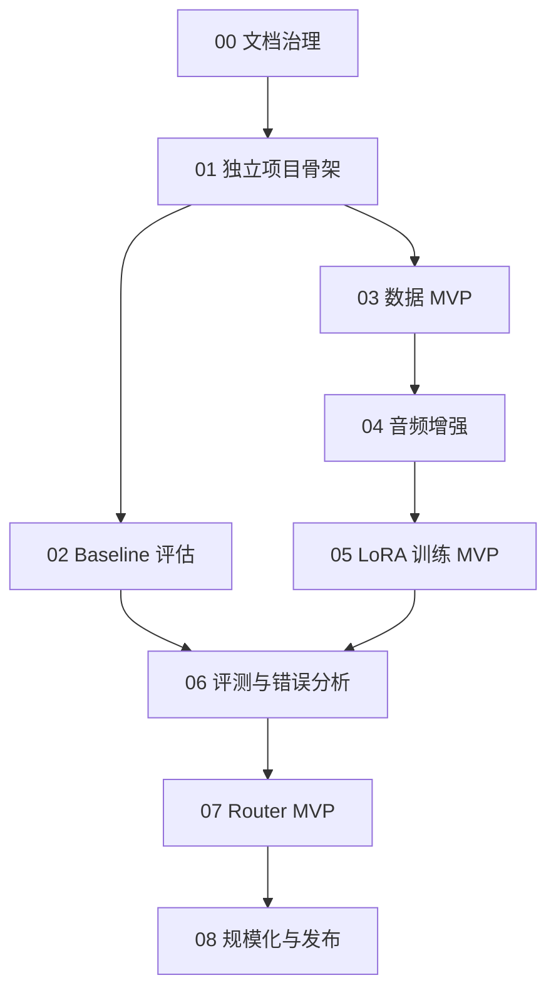

# 路线图总览

最后更新：2026-06-11

## 最终目标

本项目的最终目标是完成一个类似 Mega-ASR 的鲁棒 ASR 产品：能够在 clean speech 和真实退化音频之间稳定工作，针对噪声、远场、混响、遮挡、压缩、失真、dropout 等复杂场景提供可靠转写能力。

这里的“类似 Mega-ASR”指产品能力和方法方向类似，而不是代码实现类似。我们的系统应基于 Qwen3-ASR-1.7B 独立开发，拥有自己的数据管线、训练流程、推理服务、router、评测体系和发布文档。

## 产品形态

最终产品应包含：

- 一个 Qwen3-ASR-1.7B 鲁棒 ASR LoRA adapter。
- 一个可选音频质量 router，用于判断是否启用鲁棒 LoRA。
- 一个统一推理入口，支持 base、LoRA always-on、router 三种模式。
- 一套可复现的数据构建和音频增强管线。
- 一套 WER/CER、scenario-level、失败样本分析评测工具。
- Colab 训练 notebook 和脚本化训练入口。
- 清晰的模型使用说明、限制说明和 benchmark 报告。

## 为什么要分步骤做

鲁棒 ASR 产品不能直接从“训练模型”开始。必须先完成 baseline、数据、增强、训练、评测、router 的闭环，否则无法判断训练是否真的有效，也无法定位问题来自模型、数据、语言设置、评测还是推理路径。

路线图的每一步都只解决一个核心问题：

1. 先建立规则。
2. 再建立独立项目结构。
3. 再测 base model。
4. 再构建数据。
5. 再生成退化场景。
6. 再训练 LoRA。
7. 再做统一评测。
8. 再做 router。
9. 最后扩大规模并形成产品发布候选。

## 每一步在做什么

### 00 文档治理

目的：

- 确保所有功能先有设计、测试和验收标准，再进入实现。

解决的问题：

- 防止实验无法复现。
- 防止代码先行导致架构混乱。
- 防止只做功能、不记录指标和风险。

完成后得到：

- 文档先行规范。
- 功能维度文档要求。
- 每个阶段必须通过的文档标准。

### 01 独立项目骨架

目的：

- 从 Mega-ASR 参考仓库中抽离出来，建立我们自己的项目结构。

解决的问题：

- 避免后续代码混入 Mega-ASR 上游工程的私有实现。
- 为数据、训练、推理、评测、router、notebook 提供清晰落点。

完成后得到：

- 独立目录结构。
- 基础配置文件。
- 示例 JSONL。
- 每个目录的职责说明。

### 02 Baseline 评估

目的：

- 测量 Qwen3-ASR-1.7B 原始 ASR 能力。

解决的问题：

- 如果没有 baseline，就无法证明 LoRA、数据增强或 router 是否有效。

完成后得到：

- base Qwen3-ASR 的 WER/CER。
- clean/degraded 场景表现。
- 空输出、幻觉、漏词等初始失败样本。

### 03 数据 MVP

目的：

- 构建首批可训练、可评测、可复现的数据 manifest。

解决的问题：

- 训练需要稳定数据来源。
- 评测需要固定 test set。
- 每条样本需要 scenario 标签，否则无法知道模型在哪些场景提升。

完成后得到：

- `train.jsonl`
- `val.jsonl`
- `test.jsonl`
- 数据统计和泄漏检查结果。

### 04 音频增强

目的：

- 生成可控 degraded audio，覆盖真实世界常见失败模式。

解决的问题：

- 真实退化数据难以一次性收集齐。
- 只用 clean speech 无法训练鲁棒性。

完成后得到：

- noise、reverb、far-field、clipping、dropout 等退化样本。
- 每条增强样本的参数记录。
- 可复现的增强配置。

### 05 LoRA 训练 MVP

目的：

- 训练第一版 Qwen3-ASR 鲁棒 ASR LoRA adapter。

解决的问题：

- 验证 Qwen3-ASR-1.7B 是否能通过参数高效微调改善 degraded ASR。
- 验证 Colab 训练路径是否可行。

完成后得到：

- 可保存、加载、推理的 LoRA adapter。
- 训练配置和 checkpoint。
- 第一版 base vs LoRA 对比结果。

### 06 评测与错误分析

目的：

- 建立统一评测体系，判断训练是否真的有效。

解决的问题：

- 单看 overall WER 可能掩盖某些场景退化。
- 只看几个样例容易误判模型效果。

完成后得到：

- overall WER/CER。
- scenario-level WER/CER。
- clean regression 报告。
- 空输出、重复输出、幻觉样本分析。

### 07 Router MVP

目的：

- 判断输入音频是否退化，并决定是否启用鲁棒 LoRA。

解决的问题：

- LoRA 可能改善 degraded audio，但损害 clean audio。
- 产品需要在不同音频质量下自动选择更合适的推理路径。

完成后得到：

- clean/degraded 分类器。
- router threshold。
- base、always-LoRA、router 三种模式对比。

### 08 规模化与发布

目的：

- 从 MVP 扩展为可发布的鲁棒 ASR 产品候选。

解决的问题：

- MVP 只能证明可行，不能代表产品级能力。
- 产品发布需要更大数据、更完整 benchmark、更清晰限制说明。

完成后得到：

- release candidate adapter。
- benchmark 报告。
- model card。
- 使用说明。
- 已知限制和适用场景。

## 阶段关系

## 总体验收标准

项目达到“类似 Mega-ASR 的产品雏形”时，应满足：

- 有独立 Qwen3-ASR 鲁棒 ASR adapter。
- 有可选 router，能在 clean/degraded 输入间切换策略。
- 有统一推理入口。
- 有固定 benchmark 和 scenario-level 指标。
- 在 degraded 场景上相对 Qwen3-ASR base 有稳定提升。
- clean speech regression 被控制在明确阈值内。
- 数据、训练、推理、评测均可复现。
- 文档说明适用场景、限制和未覆盖风险。
